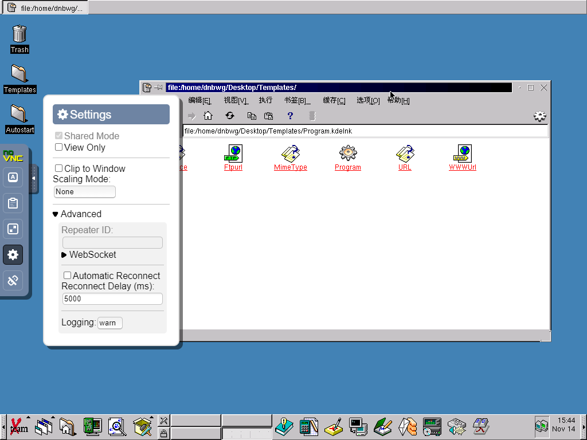
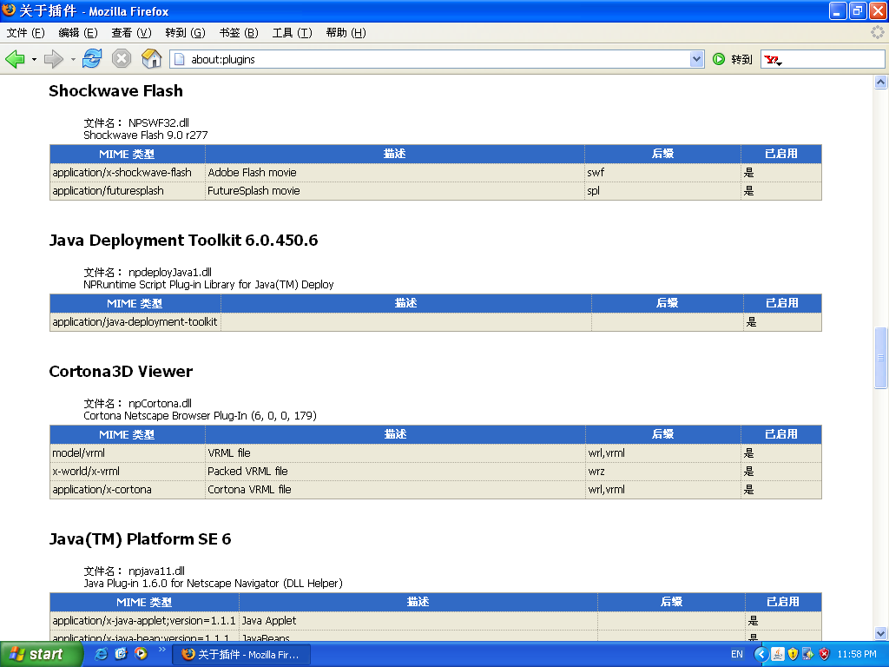
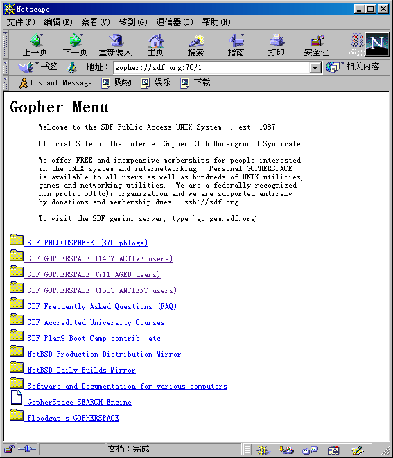
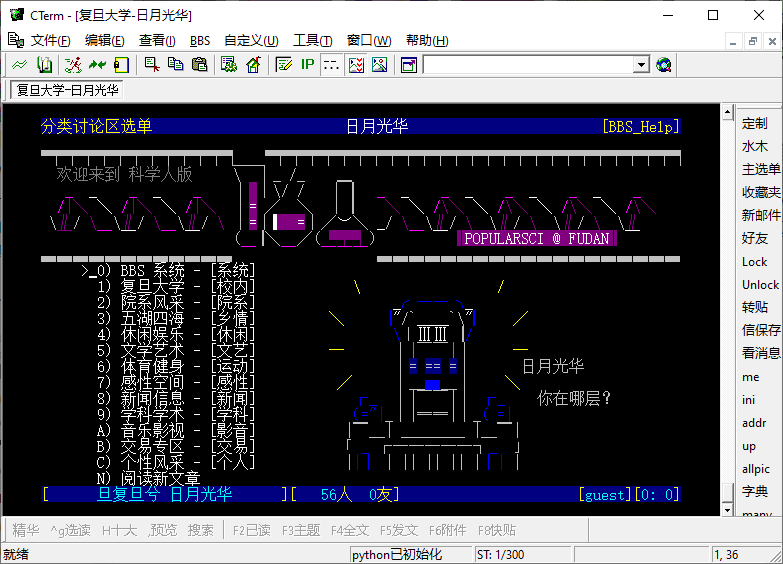

# Internet and Streaming Media
Today, when we talk about the "Internet," most of the time, we're discussing the World Wide Web (WWW). This often leads to the misconception that the advent of WWW and HTML marks the beginning of the Internet, even being thought of as the sole application on the Internet. However, atop the TCP/IP protocol that the Internet relies on, there exist numerous diverse application layer protocols, with HTTP being just one among them. Even within many scenarios employing HTTP as the application layer protocol, varied application forms emerge based on the data being transmitted.

## Powerful Modern Web Standards
Modern web standards consist of two fundamental components: HTML and JavaScript. They've undergone several expansions, especially after the emergence of HTML5 in 2008 and ECMAScript 2015 (ES6) in 2015, making these standards highly robust and intricate. Many functionalities within the [Computer Museum on the Web](https://www.compumuseum.com) utilize modern web technologies, incorporating HTML5, modern JavaScript standards, and WebAssembly. The emulators for most vintage computers in the "museum" run on WebAssembly. WebAssembly technology arrived relatively late, gaining mainstream browser support only in 2017. It compiles software into bytecode close to CPU machine code, offering faster speeds than text-based standard JavaScript code.

Moreover, the Computer Museum on the webpage utilizes WebSocket technology, introduced in 2011, to enable real-time communication. The remote desktop of the "Chinese Linux of the Millennium" online exhibition uses [noVNC](https://novnc.com/), which employs WebSocket. Another modern web technology used in the Computer Museum on the webpage is WebGL, also from 2011. In "3D-Dance: VRML of the 90s," [X_ITE](https://github.com/create3000/x_ite/) library converts 3D content created with VRML into WebGL supported by modern browsers and embeds it within HTML5 web pages for display.

While the Computer Museum on the webpage greatly benefits from contemporary web technologies, the aforementioned software functionalities aren't exclusively achievable solely through modern web technologies. In fact, whether it's remote desktops within browsers or three-dimensional graphics within browsers, these were already implemented in the 90s or 2000s, preceding the advent of modern web technologies. However, their original solutions were abandoned by modern browsers, restricting their viewing to specialized "museum" websites. This represents a dramatic conflict and issue that the Computer Museum on the webpage aims to demonstrate to its audience.

## Browser Plugins
Before the emergence of modern web standards, enriching web content in browsers often relied on browser plugins. In the previous lesson, we saw some works on mobile devices utilizing typical web technologies of the 90s and 2000s like Flash or VRML. These creations using web technologies on mobile devices were influenced by the prosperous era of Net Art in the 90s.

Browser plugins, concerning development technologies and operating environments, generally fall into two major categories: one is NPAPI plugins, primarily supported by Netscape Navigator browsers and its derivatives like Mozilla and Firefox, stemming from Netscape. The other category is ActiveX, primarily supported by Microsoft's Internet Explorer and various IE "shells" like MyIE and Maxthon (originally derived from MyIE as MyIE2). ActiveX offers functionalities similar to NPAPI, but many USB tokens used by online banks only function on Internet Explorer due to their drivers being compatible solely with ActiveX plugins.

Common web environments in the 2000s often configured support plugins for various network media formats, including VRML, Java Applet, QuickTime, Flash, Shockwave (Director), and Silverlight. Before HTML5 became prevalent, these plugins were essential for presenting multimedia content through the web.

Starting in 1999, Intel released the Intel Web Outfitter Tool Kit CD bundled with computers powered by the Pentium III processor, known as the "Intel Web Outfitter Tool Kit" in Chinese. This CD primarily contained various browser plugins, including common ones like Real Player, Flash Player, Shockwave, Superscape Viscape SVR (supporting 3D graphics), IPIX Player for panoramic images, and RealSlideshow for slideshows.

While these browser plugins varied in types, they roughly offered functionalities in three categories: interactive graphics (e.g., Flash), streaming audio/video (typical examples being Real Player, Windows Media Player, and Quicktime), and 3D graphics for the web (like VRML viewing plugins such as Cosmo Player and Cortona).

If you wish to investigate typical browser plugins and their content, I strongly recommend starting your research with [BlueMaxima's Flashpoint](https://flashpointarchive.org/). It's currently one of the most comprehensive preservation initiatives for web games, preserving content created for over 30 different browser plugin platforms.

## Interactive Graphics: Macromedia Flash and Shockwave

Flash is a widely familiar web plugin in communities. It serves two primary purposes: game development and animation. Interestingly, the popularity of Flash animations was notably higher in China and South Korea than in Western developed countries. One speculated reason could be the cost of equipment required for creating dynamic images: in the 2000s, hardware like cameras and capture cards for producing online videos posed a considerable burden for enthusiasts. Flash, however, required no additional hardware investment and could be operated using standard computers for dynamic image creation. In Western countries where home-use cameras were more prevalent, Flash was more commonly used for games, website banners, landing pages, and other web content requiring strong interactivity and visual presentation.

Shockwave, generally produced using Macromedia Director, offered more robust interactive features than Flash. It supported advanced graphics functionalities such as native 3D capabilities and also accommodated Xtras. Xtras were compiled plugins for Shockwave that could utilize native binary code, supporting additional audio/video file formats or providing developers with customized functionalities. However, Shockwave files were larger in size due to this, consuming more bandwidth and resources. Consequently, Flash dominated in web interactive content, while Shockwave was more often utilized for multimedia content in CD-based software.

Artists created numerous web artworks using Flash and Shockwave as platforms. For instance, Austrian artist [LIA](https://www.liaworks.com/) crafted [RE-MOVE](https://re-move.org/index.php), German artist Esther Hunziker developed [UN_FOCUS](https://estherhunziker.net/unfocus/) using Flash, and American artist Nathaniel Stern incorporated interactive segments made with Flash along with Quicktime video clips for the [Hektor](https://nathanielstern.com/artwork/hektor-net/).

Readers familiar with Flash might wonder why Hektor used QuickTime for video content, considering Flash and its FLV video format were once prevalent streaming video formats on the web, particularly before the advent of H.264. Websites like YouTube, for instance, used Flash and the FLV format for online video streaming. This was because Hektor was completed in 2000, a time when Flash had minimal video playback support. It wasn't until Flash Player 6 in 2002 that embedded video playback in SWF files began, and it was Flash Player 7 in 2003 that started supporting the FLV video format.

## Challenges in Digital Format Accessibility

While the mentioned works are preserved, accessing them in their entirety today proves challenging for audiences. Most modern browsers struggle to open these websites. Content developed for browser plugins faces several limitations:

- Changes in browser versions render plugins unusable; for instance, Chrome 42 (2015) started disabling NPAPI plugins.
- Version changes in plugin file formats render content unusable; newer versions of Windows Media Player may fail to open many NetShow contents, and QuickTime 7.3.1 (2007) no longer supports Flash tracks embedded within MOV files, among other issues.
- Evolving network transmission protocols like SSL encryption hinder old plugins from transmitting content correctly; many older browser plugins do not support the TLS 1.2 encryption introduced in 2008.

Consequently, net art is far more fragile than commonly perceived. For researchers and collectors, digital preservation stands as the first barrier. They not only need to store the files but also maintain the entire technological framework. Saving the files alone without software and hardware capable of opening them results in an incomplete and meaningless viewing experience.

In May of this year, "Input" published an article titled "[Christie's Warhol NFT is basically a fake](https://www.inputmag.com/culture/what-exactly-is-christies-selling-in-its-warhol-amiga-nft-auction)" quoting criticisms from the Warhol Data Recovery Project participant, Professor Golan Levin of Carnegie Mellon University, highlighting that Sotheby’s auctioned "altered, 2nd-generation near-copies" The auctioned version enlarged the original image from 320x200 pixels to 6000x4500 pixels inaccurately, making it more of an exhibition copy.

In Professor Levin’s tweet, a compromised yet relatively faithful exhibition example was demonstrated: during the 30th-anniversary exhibition of the Creative Inquiry studio at Carnegie Mellon University, they collaborated with the Andy Warhol Museum. They used modern PCs and PNG images as the video source, outputting them to a 1985 original Amiga computer monitor via a simulated composite video line (AV cable). This allowed viewers to see Andy Warhol's digital paintings, originally created on an Amiga computer, as close to their original state as possible. The challenge of digital preservation might make it difficult, or even impossible, to fully restore a piece to its original state. Yet, we must be aware and judicious in choosing compromises.

## Streaming Media: RealPlayer and QuickTime

HTML5, compared to previous HTML standards, notably introduced the video and audio tags, enabling HTML5-supported browsers to play video and audio content without relying on third-party plugins. However, it wasn't until 2009 that Firefox and Chrome added support for these tags, and Microsoft’s Internet Explorer followed suit with IE9 in 2011. Therefore, throughout the 2000s, almost all video content available online had to be played using browser plugins. Apart from Flash and FLV, Apple's QuickTime and Real Networks' RealPlayer (renamed RealOne Player between 2000 and 2004) were the most commonly used streaming media player plugins.

The initial version of RealPlayer debuted in 1995, initially supporting only audio playback, known as RealAudio Player. It was the first media player capable of streaming audio at low bandwidths, like 28.8Kbps, on dial-up networks. The [CaféMuse](https://www.cafemuse.com/) is a music education website established in 1996 hosted some early online audio resources at a low bitrate of 16Kbps, offering acceptable music quality. Additionally, Dan Tsang from the University of California, Irvine, preserved [RealAudio format recordings of his Subversity](https://kuci.org/~dtsang/subversity/realaudio.htm) left-wing commentary program broadcasted on the KUCI 88.9 radio station from 1998 to 2003, all stored at 16Kbps for low-bandwidth dial-up listening conditions.

QuickTime was another common plugin used to deliver audio and video content online. However, compared to Real Player, websites streaming audio and video content in the QuickTime format were less prevalent. But QuickTime offered features that RealPlayer did not possess. The most crucial among these was QuickTime VR (QTVR). During the late '90s and early 2000s, QTVR was the primary means of providing virtual reality exhibitions online. For instance, HR Giger Museum's [QuickTime VR virtual exhibition](https://hrgiger.com/quicktime.html) in 2001 showcased images limited by '90s network bandwidth, yet the functionalities achieved through QTVR mirrored the previously popular "360° virtual house tours."

Similar to many current VR exhibitions, QuickTime VR enabled hot-spot navigation. By clicking hotspots within the interface, users could navigate to different scenes. The [QTVR moon base](http://www.cotf.edu/BioBLAST/bioproject/qtvr/qtvrintro.htm) at the Wheeling Jesuit University/NASA Classroom of the Future utilized this hotspot navigation feature.

QuickTime VR could display scenes and create 3D object showcases. Objects showcased in QTVR weren't actual 3D models but were a series of photographs taken with a turntable and simulated viewpoint changes through software-controlled mouse interactions. Even today, many websites feature 360° product displays created in a similar manner, and turntables used for capturing 3D objects are still available. The "[Mysteries of Egypt](https://www.historymuseum.ca/cmc/exhibitions/civil/egypt/egqtvr1e.html)" VR exhibition produced by the Canadian Museum of History in 2001 used QuickTime VR's 3D object showcasing feature.

Similar to Flash and Shockwave, artists once used the streaming media capabilities of QuickTime and RealPlayer to create various net art pieces. Cory Arcangel's "Data Diaries" from 2003 employed QuickTime videos and flickering grids as the primary presentation method.

In 1995, a group of artists created the [KUNSTRADIO](http://kunstradio.at/) website to archive broadcasts from the Austrian national radio ORF's cultural channel Oesterreich 1’s radio art program KUNSTRADIO. Real Audio format and RTSP protocol were used to transmit the audio programs on this site.

American artist Caroling Geary released numerous works created using QuickTime VR on [her website](https://wholeo.net/). Many QuickTime VR panoramic works created using similar technology were collected and showcased by the panoramic image website [World Wide Panorama](https://www.worldwidepanorama.org/).

## 3D Graphics on the Web: VRML and X3D

The practice of transmitting 3D content on the internet emerged in the '90s. The first widely used 3D content standard online was VRML (Virtual Reality Modeling Language). Its origins trace back to Dave Raggett, an early participant in the W3C, who published a paper titled "[Platform Independent Virtual Reality](https://www.w3.org/People/Raggett/vrml/vrml.html)" in 1994, referring to VRML as "VR markup language." By the time VRML was standardized in 1995, it was renamed "Virtual Reality Modeling Language."

VRML was quite comprehensive, supporting 3D models, scenes, animations, and hyperlinks for transitioning between different scenes. It facilitated user interaction within the scenes and was widely used in the '90s for building various 3D social network platforms like Cybertown and SAPARi. In 2001, the [Web3D Consortium](https://www.web3d.org/), responsible for maintaining the VRML standard, introduced a new XML-based format called X3D. Even today, the X3D standard is under development and maintenance, similar to SVG (Scalable Vector Graphics) used for 2D graphics in web standards.

Due to VRML and X3D relying on browser plugins for viewing, lacking broad support from major browser maintainers like Microsoft, Apple, and Google, their application gradually deviated from their initial purpose of transmitting 3D graphics on the web. Instead, they became 3D graphics standards for cross-platform applications in research and engineering fields. Many 3D graphics software packages support importing and exporting X3D and VRML formats.

In the late '90s and early 2000s, VRML found its place in the new media art scene. The European Media Art Festivals (EMAF) in 1999 showcased a series of VRML-based works under the [VRML-ART](http://2016.emaf.de/emaf.de/_emaf/www.emaf.de/1999/german/vrml-art.html) topic.

### Proprietary 3D Formats
VRML was an open format, but its standard's evolution was constrained by the balancing act of various manufacturers within the Web3D Consortium. Consequently, many developers created their proprietary 3D formats, such as Cryo Interactive's SCOL (Standard Cryo Online Language), Superscape Viscape, and Adobe Atmosphere Player. However, none of these formats gained widespread popularity like VRML. For researching related content, BlueMaxima's Flashpoint is an excellent starting point.

### Beyond the WWW: Other Protocols
Apart from the World Wide Web (WWW), several crucial protocols exist on the internet, constituting the "inner world" compared to the WWW's "outer world."

One such protocol is Gopher, developed by the University of Minnesota in 1993. It's a network protocol that organizes and retrieves information in a directory-like structure. It was a significant competitor to the WWW in the '90s, and support for Gopher sites continued in mainstream web browsers like Internet Explorer and Netscape until the early 2000s.

Another vital internet protocol is Telnet, enabling access to remote software systems through emulated terminals. In the Chinese-speaking world, Telnet had a significant influence on sites like PTT in Taiwan and various Telnet BBS (Bulletin Board Systems) in mainland China, such as Tsinghua University's water-moon-clear mirror, Peking University's Hero, Huazhong University of Science and Technology's Baiyun Yellow Crane, Fudan University's Sun-Moon-Light-Hua, among others. These BBS were typically operated and maintained by universities. Additionally, MUD (Multi-User Dungeon) games like Peking University's Xiakexing were also accessed using Telnet.

Usenet, the network of newsgroups, operated on the internet using the NNTP (Network News Transfer Protocol). Currently, [Newsfan](#user-content-fn-1)[^1] is the only known Usenet newsgroup still running in China. Google Groups also archives a wealth of early Usenet information, including alt.chinese.text, the earliest known Chinese-language postings, offering valuable insights into the early Chinese online community.

[^1]: Newsfan (新帆新闻组): news://news.newsfan.net
