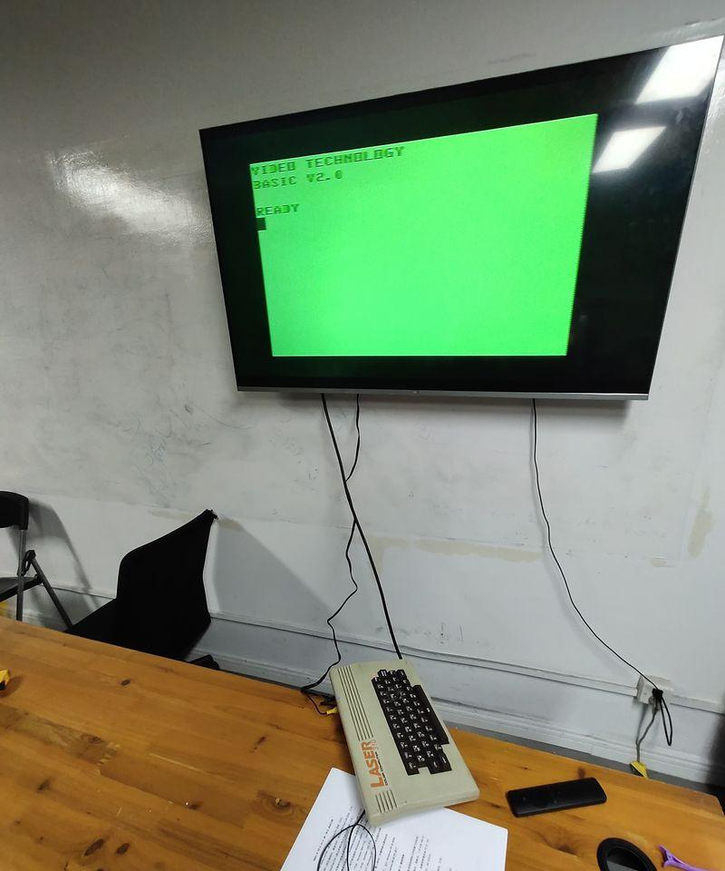

# Multimedia Computers

Today marks the fourth session of our digital media archeology experiments, and we're diving into the realm of multimedia computers. Before the 1990s, there was less awareness regarding computers as a medium; their value was often seen in their computational capabilities. However, today, discussing media invariably involves understanding the role of computers. Our demonstration in the first session with the AR game on the Treo phone vividly showcased the modern computer's prowess in handling media: it captured live visuals via the camera, synthesized animated characters with computer-generated imagery displayed on the screen, and responded to player inputs. Although the game may now seem less cutting-edge, it encapsulates many core issues related to media processing.

Today, we often refer to the concept of "transmedia art," encompassing intermedia and transmedia, each with distinct nuances that many papers discuss in great detail—yet, we won't delve deeply into those distinctions here. However, both concepts involve blending and interacting among various media. In a transmedia work or project, it's common to see a fusion of elements from books, television, movies, web pages, and more, creating connections and even enabling interactivity among them.

The primary conduit for interoperating between diverse media today is the computer. Modern PCs can handle almost every kind of media imaginable. They not only manage electronic communication methods like telephony, broadcasting, television, and audio recording but also facilitate digitizing non-electronic media easily. For instance, a scanner can digitize paper documents for interaction with computer programs. Hence, even when not serving as the final presentation platform, PCs often act as intermediaries when working with various media during creative processes.

# TV Output

Next, let's revisit a classic case, the 1987 "[Painting with Light](https://genome.ch.bbc.co.uk/18900b0c0fe6426b922b26c45fecd570)" series by the BBC, inviting renowned artists such as David Hockney and Howard Hodgkin to create drawings using the Quantel Paintbox computer device.

The Quantel Paintbox, released in 1981, was the earliest commercial tool enabling computer drawing within television signals and marked the advent of commercial computer-based painting software. In 1996, [Quantel sued Adobe](https://inst.eecs.berkeley.edu/~eecsba1/sp98/reports/eecsba1f/Final.html#Adobe) over computer painting patents, referencing Richard Shoup's 1973 SuperPaint. Adobe successfully defended itself based on [SuperPaint](https://citeseerx.ist.psu.edu/viewdoc/download?doi=10.1.1.94.157&rep=rep1&type=pdf), and consequently, the operation of computer painting tools is no longer under patent protection, allowing various software developers to use these methods freely.

The Quantel Paintbox served as a cross-media system, linking brushes, computer software, and television via technological means. Today, I've brought a television transmission device, a TV modulator, capable of sending video signals into a cable TV network. It's connected to this DVD player on the classroom table, acting as a video source. By modulating it through the modulator, all TVs connected to the cable can receive the program being played by the DVD player. Our modulator can simultaneously modulate four video sources onto four TV channels, effectively simulating a miniature cable TV station with four sets of programs.

A common device for modern PCs to interact with television networks is a TV card. It captures television signals and converts them into digital video within the computer. PCs also have the capability to output signals to television networks. Many graphics cards are equipped with TV-out or S-Video, allowing them to output video signals compatible with television standards.

Television capture cards and similar devices became popular after the 1990s, something I'll discuss later. Prior to that, video capture equipment was often expensive, like the Quantel Paintbox, which cost around $20,000 and was mainly affordable for professional studios. The 1990 NewTek Video Toaster was the first affordable video effects system for enthusiasts and small studios, priced at approximately $3,000. Recently, I bought a TV card for just 30 RMB, allowing us to achieve tasks that were previously exclusive to professionals at a significantly lower cost.

It's notable that the capacity for computers to output video predates their ability to input video by a significant margin. For "home-use" computers, video output can be considered an innate feature. Early personal computers like the Apple II and ZX 81 could utilize televisions as display devices, primarily aimed at reducing purchase and operational costs. Meanwhile, systems such as the Atari 8-bit series and Commodore VIC-20 were designed as a fusion of TV gaming consoles and computers, inheriting the habit of being used with televisions like gaming consoles. These personal computers, akin to early TV gaming consoles, exhibited slight performance disparities due to variations in the NTSC or PAL television standards.

The visuals of home computers supporting TV output could be recorded by VCRs and could make use of various analog TV signal processing devices. Today, I've brought a Laser 310, a computer commonly found around 1984-85, manufactured by Hong Kong's VTech. In China, this computer was widely imported for educational purposes, hence making it one of the most commonly found vintage computers domestically. In the upcoming segment on "Vintage Personal Computers" in this course, I'll delve into the detailed usage of this machine. However, today, its primary purpose is to showcase its interoperability with televisions.

The Laser 310 can output to a television in two ways. One method is through composite video signals, known as an AV line. AV interfaces can still be found on today's televisions, allowing modern LCD TVs to connect to the Laser 310 computer. Additionally, the Laser 310 is equipped with an RF modulator, a feature common in many old-school computers but less prevalent in today's technology, which directly transmits signals to a TV tuner.

### HyperCard

The next software to mention is HyperCard. While the visual and auditory language of computer software and games still, to a considerable extent, draws from the logic of movies and TV, the development of computer interactivity is a facet unique to the medium. Introduced in 1987, HyperCard was the first widely used hypermedia tool, supporting button-driven navigation while also allowing the embedding of visual and auditory resources like images and sounds into its cards. HyperCard's organizational approach profoundly influenced the development of the World Wide Web. The first browser supporting embedded images and tables, ViolaWWW, [cited HyperCard as an inspiration](https://web.archive.org/web/20220831020010/http://viola.org/viola/violaIntro.html) for its functionality design.

Older Macintosh programs like HyperCard can no longer run on today's Macs. To demonstrate it, I've prepared a PowerMac G4, a model from 2003. It showcases several configurations different from modern computers, such as a display interface using the dedicated ADC (Apple Display Connector), which can transmit both images and power. This computer can run the native Mac OS 9, thus supporting most software developed for Motorola 68K processor-based Macintosh systems before the mid-1990s.

### CD-ROMs and Optical Discs

A crucial milestone in the formation of the modern multimedia computer concept was the emergence of the CD-ROM. HyperCard, as mentioned earlier, was often utilized for creating CD-ROM content. In the early 1990s, CD-ROMs represented the largest available storage capacity for personal computers. With a capacity of 640MB, CD-ROMs surpassed the storage limits of personal computer hard drives during that time. For instance, the first Apple computer with a built-in CD-ROM drive, the Macintosh IIvx in the latter half of 1992, had a standard hard drive of only 80MB, making the CD-ROM's capacity several times larger.

Even the PowerMac G4 produced in 2003, which we're using for the demonstration, had a hard drive capacity of only 60GB, accommodating less than 100 CD-ROMs. By the mid-1990s, the introduction of DVD-ROMs increased the storage capacity to 4.7GB per disc, meaning it would take just 12 to 13 discs to fill up this computer's hard drive.

Therefore, CD-ROMs, representing optical media, served as substantial storage devices for a considerable period. The widespread adoption of CD drives made it possible to distribute software content that was previously difficult to carry using floppy disks as the primary distribution method. Games distributed on CD-ROMs often included high-quality pre-recorded audio for background music and sound effects. Many also featured pre-rendered high-quality cinematic videos, content that couldn't fit on floppy disks. Some artists attempted to distribute their multimedia works via CD-ROM. Sandra Fauconnier, a Belgian art historian, established "[The CD-ROM Cabinet](https://cdromcabinet.tumblr.com/)", an art preservation project for CD-ROMs, making some disc image files available for public access via the Internet Archive.

One of the demonstrations to follow is the game "Myst," one of the most iconic early CD-ROM games and the best-selling PC game of the 1990s, with sales reaching 6 million copies, a figure surpassed only in 2002 by "The Sims." It's worth noting that the initial version of Myst was developed on a Macintosh using HyperCard.

Another showcase is "Qu Ri Liu Hen," produced by one of China's earliest internet companies, Infohighway. It was developed using Authorware. Since Apple's HyperCard was exclusive to Macintosh computers, Authorware and Director became the most commonly used software for creating multimedia CD-ROM content on the PC platform. They emerged around the same time as HyperCard, with Authorware in 1987 and Director in 1985.

In 1993, the companies behind Authorware (Authorware Inc.) and Director (MacroMind) merged to form Macromedia. In 1996, Macromedia acquired FutureSplash, the developers of Flash. These three software titles—Authorware, Director, and Flash—essentially dominated the multimedia content creation market on IBM PCs from the late 1990s to the early 2000s. In 2005, Adobe acquired Macromedia and gradually ceased development of Authorware and Director.

The organizational logic behind HyperCard, Authorware, and Director differs. HyperCard's fundamental unit is the "card." Authorware utilizes flowcharts to organize content, while Director evolved from animation software, using a timeline-based frame sequencing logic similar to Flash. Both Authorware and Director were very popular in the 2000s, particularly in creating educational courseware, making related materials and tutorials relatively easy to find. By the late 1990s, web technologies were also used in multimedia CD-ROM production. InfoHighway's "Beyond 2000" utilized web pages within a browser to organize its content.

## Standardization of Multimedia PCs

Before the 1990s, the term "multimedia" wasn't closely associated with computer use. The widespread understanding of multimedia today owes much to the efforts in the 90s by computer software and hardware giants like Microsoft, Creative, Dell, and others, who established the Multimedia PC Marketing Council to heavily promote the MPC (Multimedia PC) standard in the PC market. During this period, the most significant feature of multimedia PCs was their ability to provide content synchronized with sound and images, primarily based on CD-ROMs. The CD-ROM drive stood as a central component in this series of standards, as reflected in the CD-ROM image in the MPC logo.

- 1990: Establishment of the Multimedia PC Marketing Council
- 1991: Multimedia PC Level 1: 386SX (16MHz), 2MB RAM, 40MB HDD, 1x CD-ROM
- 1993: Multimedia PC Level 2: 486SX (25MHz), 4MB RAM, 160MB HDD, 2x CD-ROM
- 1996: Multimedia PC Level 3: Pentium (75MHz), 8MB RAM, 540MB HDD, 4x CD-ROM, MPEG-I, 352x240, 30fps (VCD-level MPEG video)

To understand the development of multimedia computers during this period, one can refer to Professor Chen Liuqin Zhi's paper "[Understanding Multimedia Information Systems: Today's Achievements and Tomorrow's Possibilities](http://web.simmons.edu/~chen/nit/NIT'92/049-che.htm)" presented at the NIT'92 conference. The paper describes the dominant position held by CD-ROMs and various CD standards in multimedia systems in the early '90s. Additionally, the Tate Gallery introduces [some multimedia works](https://www.tate.org.uk/art/art-terms/m/multi-media) beyond computers.

## Codecs

In Multimedia PC Level 3, there's an additional requirement compared to the previous levels: MPEG-I decoding capability. MPEG-I video coding is the image compression standard used for VCDs (Video CD), and the ability to play VCDs was a significant selling point for multimedia computers during that period.

When discussing MPEG-I encoding, it's essential to explain some concepts frequently mentioned in handling audiovisual content. Codec is short for Coder/Decoder, which refers to the software (although sometimes hardware) component responsible for both encoding and decoding video and audio in computers. Typically, different codecs are used for video and audio encoding, like the commonly used H.264 for video and AAC for audio.

Encoded audio and video data need to be multiplexed using an audio-video multiplexer (Muxer) into a "container" file. Different audio muxers support various container file formats, such as MKV or MP4.

During playback, the process reverses: playback software demultiplexes the container file to extract the compressed encoded audiovisual data, which is then sent to the respective decoders to reconstruct audio and video streams.

Codecs stand among the most crucial software components in multimedia computers and are a fiercely competitive arena, often surrounded by licensing fees and patent barriers. Many influential and capable manufacturers in related industries have staked their claims here, resulting in codec fragmentation. In the realm of personal computer video in the early '90s, Apple Video (1991), Intel's Indeo (1992), and Microsoft Video 1 (1993) were all prevalent codecs utilized in various software applications.

## QuickTime and DirectX
Let's dive into the two most pivotal multimedia architectures: Apple's QuickTime and Microsoft's DirectX. QuickTime by Apple was developed with a focus on handling audiovisual content. The earlier mentioned Apple Video was among the earliest video codecs supported by QuickTime. Over its 30-year development journey, new codecs like MPEG-1, MPEG-2, MPEG-4, H.264, and those specifically designed for post-production, such as ProRes, have been integrated into QuickTime. The MOV container format is also emblematic of QuickTime, and videos shot on today's iPhones are in the MOV format. QuickTime has evolved to include features like QuickTime interactive (QTi) and QuickTime VR.

Now, let's shift to Microsoft's DirectX. Microsoft, differing from Apple's emphasis on audio and video codecs and interaction around audiovisual content, DirectX focuses more on program APIs, particularly the 3D graphics capabilities used in gaming. The Direct3D API, utilized for real-time 3D rendering, is the most powerful and progressive part of DirectX. Starting from DirectX 7 in 1999, with support for hardware T&L (Transform & Lighting), the version numbers of DirectX have largely become milestones for consumer-grade graphics cards. For instance, the Geforce MX440 in our Pentium 4 showcase unit is a Direct3D 7.0 level graphics card, supporting hardware T&L but lacking Pixel Shader capabilities.

Direct3D is a relatively lower-level API that allows software to directly manipulate graphics card functions. However, these graphic functionalities are highly intricate and swiftly evolving, raising the bar for game development. Some gaming companies open up their game's graphical capabilities for licensing to other developers, leading to the creation of game engines. Engines like idTech (Quake series), GoldSrc (Half-Life), and Unreal Engine began licensing for use by other developers by the late '90s.

The proliferation of 3D graphics cards also provided a new platform for the demoscene community to craft real-time visual programs. Demotools like [Werkkzeug](https://github.com/farbrausch/fr_public) offered solutions akin to game engines for real-time 3D art demos.

## Video Capture

A significant change that emerged after the mid-1990s was the enhanced interoperability between computers and televisions. Although home computers in the 1980s widely possessed the capability to output television signals, the functionality of capturing and recording television signals only started to become popular in the mid-1990s. Typically, even with dedicated video encoding and decoding hardware assistance, video processing required a 32-bit processor with a clock speed of over 100 MHz, such as the 486DX4 or PowerPC 603, both introduced in 1994.

Of course, some products were already exploring video capture earlier. For instance, in 1993, Apple released the Macintosh TV. Despite its name sounding similar to Apple TV, its functional positioning was significantly different. The Macintosh TV was a fully functional computer equipped with a 32MHz Motorola 68030 CPU, 5MB of memory, a 160MB hard drive, a 2x CD-ROM, and an integrated TV tuner. However, due to hardware limitations, it could capture TV images but was unable to record video.

Another representative attempt to integrate computers and television was the Gateway 2000 Destination in 1996. It featured a 31-inch large display, wireless keyboard and mouse, TV viewing capability, DVD playback functionality, and a remote control, representing one of the earliest realizations of the concept of a "living room computer."

Image: Apple's iMac G3 computers began integrating the IEEE 1394 interface starting from the latter half of 1999, with the white variant in the image being introduced in the summer of 2000.

A later development in the multimedia boom of the 90s was digital video or DV. During the 90s, digital video devices were expensive, and the software was not mature enough, only gaining popularity after 2000. Tape-based digital camcorders were prevalent throughout the 2000s until gradually being replaced by hard disk and flash memory camcorders after the 2010s. IEEE 1394, also known as FireWire by Apple and i.Link on Sony cameras and VAIO computers, was the most common method for tape-based digital cameras to transmit digital video to computers.

Besides connecting digital camcorders, the IEEE 1394 interface could link to analog recording devices via media converters. Digital set-top boxes also often included the IEEE 1394 interface. In the United States, the FCC mandated between 2004 and 2010 that all digital TV set-top boxes must have an IEEE 1394 interface for recording. Although the FCC updated the regulations after 2010 to allow similar functions via Ethernet, many set-top box models retained the IEEE 1394 interface.

## Paperless Fax and Multimedia Communication
The evolution of computer multimedia capabilities and widespread internet use transformed the telecommunications industry. Modems used for internet access were also extensively employed for paperless faxing, a function built into Windows 95 and subsequent versions.

In 1995, VocalTec developed the "Internet Phone," the first commercially successful IP telephony software. In 1996, Microsoft's NetMeeting, released alongside Internet Explorer 3.0, further popularized network video calling and made webcams a common computer peripheral. Internet-based voice and video calls disrupted long-distance telephone services, a significant revenue stream in the telecommunications industry, sparking the [first IP telephony lawsuit](https://www.gmw.cn/01gmrb/1999-01/01/GB/17924%5EGM10-003.HTM) in China. Jennifer Ringley, through her webcam and self-built website Jennicam, established the fundamental form of "lifecasting" or "daily casting."

Following the rapid advancements in multimedia personal computer functionality during the 1990s, the types of media handled by personal computers were essentially established: images, sound, video, interactive operations, 3D-generated imagery, discs, and communication. Even today, these remain the primary materials utilized in most multimedia art pieces.
