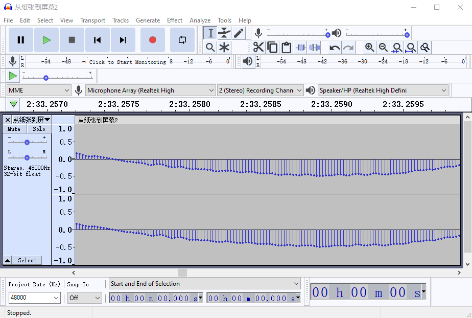
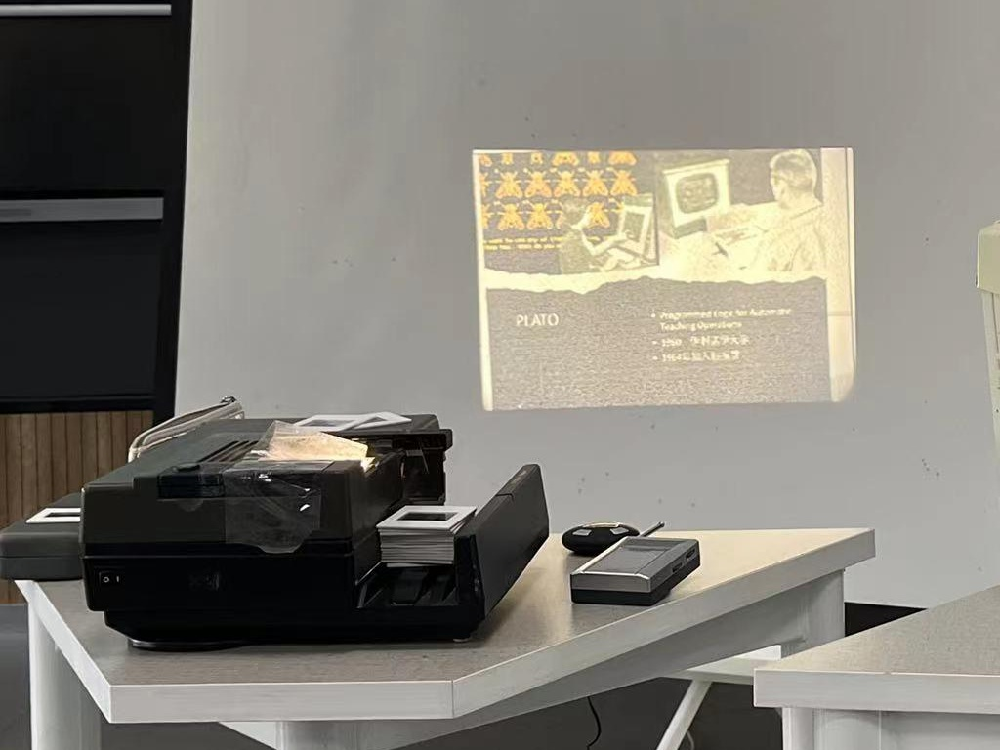
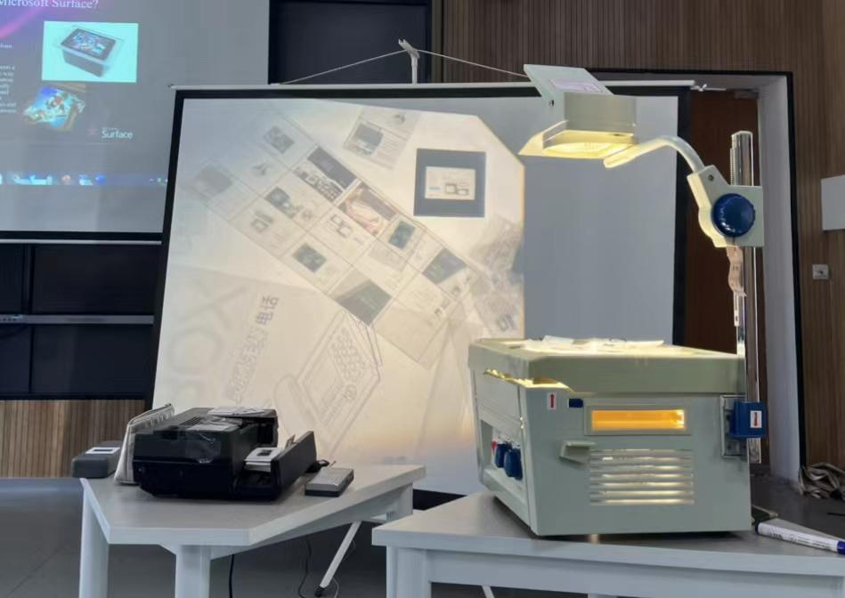
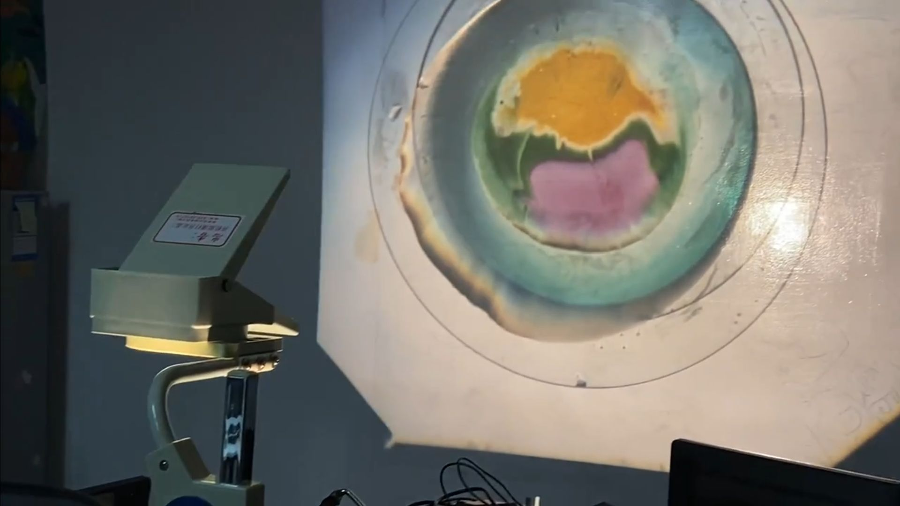
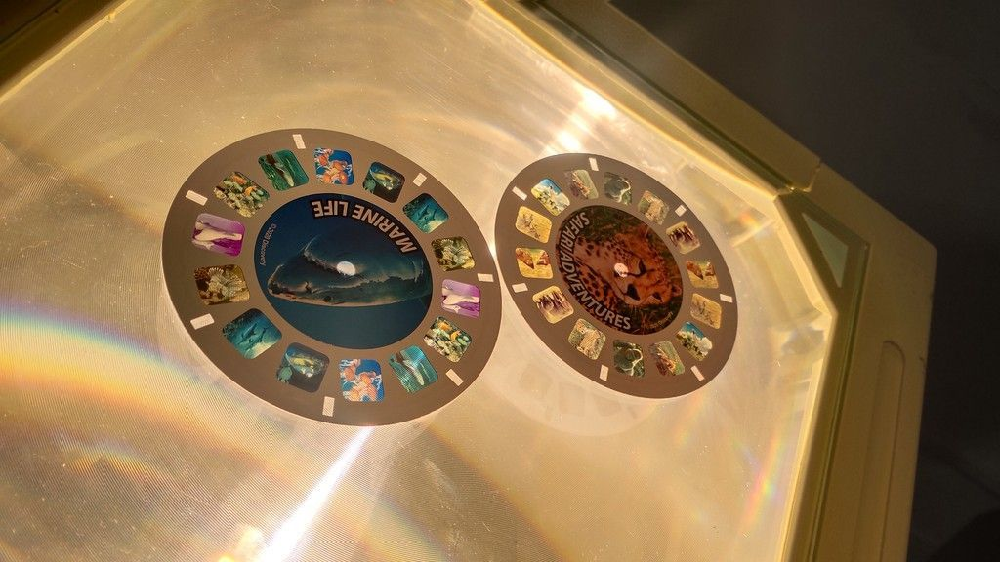

# Beyond Computers

Today marks the final session of our series: Beyond Computers. In the preceding seven sessions, we've delved into the realm of "digital media," spanning over six to seven decades of history across various hardware devices, from the large-scale mainframes of the 1950s and 1960s to today's ubiquitous smartphones. All these devices belong to the same category: digital electronic computers. They process digital data, which is the cornerstone of our series' theme, "digital media," centered around the manipulation of digital data using digital electronic computers. Whether it's manifested as hypertext, audio, video, 3D models, or interactive games, its essence lies in digital data.

However, in this session, we'll momentarily shift our focus from digital media to discussing its manifestations. Specifically, we'll explore the prevalent forms of digital media today and the origins of their attributes. Some connections are relatively straightforward to identify. For instance, digital music inherits from the legacy of the record industry, while the foundational infrastructure of digital video is widely derived from the film and television industries. Yet, some connections are profound yet concealed, not widely acknowledged.

## Discrete vs. Continuous

The fundamental and crucial distinction between "digital" and "analog" in a media system lies in the fact that data in digital media is primarily discrete. All the data within it "do not vary continuously but consist of distinct, separate values."

For example, temperature in the natural world is a continuously changing value. However, a digital thermometer can only provide limited precision. For a thermometer with a precision of 0.1℃, several states between 36.0℃ and 36.1℃ cannot be represented. To approximate continuous changes in a digital system, it often requires using a collection of numerous discrete quantities to represent, such as the sound waves in recording software, constructed through a series of discrete samples.

## Analog Computers

However, digital computers aren't the only computational tools humans have invented, nor are they the only computing tools used as media devices. In our high school math classes, we often encounter methods of solving equations through compass and straightedge constructions, which represent one form of computation performed through mechanical movements in space. Slide rules, a classic mechanical computing tool, are still used in various contexts.

The inception of computer animation also emerged from an analog computer. In the 1950s, John Whitney began experimenting with repurposing decommissioned M5/M7 gun directors used in World War II. Whitney utilized the director's ball-shaped integrator and cam mechanism to control the position of bulbs in a film, achieving some of the [earliest computer animation techniques](#user-content-fn-1)[^1]. Using this approach, he created the [opening sequence for Alfred Hitchcock's film "Vertigo" in 1958](#user-content-fn-2)[^2].

## Radios

While it's challenging to find analog computers in today's world, analog circuits remain prevalent in everyday life. One of the most common devices based on analog circuits, serving as a media device, is the radio. A simple radio typically has two adjustable knobs—one for volume and the other for tuning frequencies. Both of these knobs are analog in nature. Adjusting the radio's volume noticeably differs from digital audio systems like those found in phones or computers. The latter often have fixed "scales," such as 0 to 100, where we can only "jump" between different volume levels—a characteristic feature of discrete numerical systems. In contrast, the volume changes in analog radios are continuous; there are no fixed scales for knob angles or slider positions.

As a longstanding electronic broadcasting medium, radios share several similarities with many other electronic media. Similar to the internet, radio stations correspond to broadcast stations that have diminishing marginal costs—meaning, the more users or listeners a service has, the lower the cost per individual user. Within the signal's coverage area, regardless of the number of listeners, a radio station only needs to transmit the signal once. Therefore, the more users within a radio's coverage area, the more effective the broadcast station, similar to the logic behind mobile apps seeking more installations.

However, media with hard copies lack this advantage. Newspapers, magazines, vinyl records, and tapes are all limited by the number of copies printed or produced. The popularity of radios significantly impacted pop music after the emergence of recording and audio technology. While recording technology separated audiences from live performances, radios further disconnected audiences from storage media, virtually eliminating the cost for listeners to enjoy music through radios.

This era also saw the emergence of a particularly iconic cultural phenomenon—the pirate radio. During the 1950s to 1960s, wireless transmission equipment became inexpensive enough for amateur enthusiasts to assemble and operate. Unlicensed underground stations became crucial for the dissemination of emerging music genres, notably in the UK, where pirate radios significantly influenced the formation and dissemination of rock music. In the BBC series "[Radio Reinvented：100 Voices that made the BBC](https://www.bbc.com/historyofthebbc/100-voices/radio-reinvented/)", the first episode discusses how the BBC, while responding to competition from pirate radios, also absorbed their legacy as a popular music broadcast medium.

When radios and tape recorders combined to form recording machines, recording music from radio broadcasts became an affordable means of obtaining recordings. This sparked a backlash from the music industry; the British Phonographic Industry (BPI) campaigned against home taping in the 1980s, using slogans like "Home Taping Is Killing Music." The logo created during this campaign, featuring a cassette and a skull, was later repurposed by copyright-defying file-sharing websites like "The Pirate Bay."

One of the most influential artists to use radios in their art was John Cage. In his 1951 piece "Imaginary Landscape No. 4," he used 12 radios to generate all the sounds. His 1960 piece "Water Walk" utilized a range of everyday objects to create sound effects, including the use of radios.

## Predecessor of Multimedia: Multi-Image Projection

Today, we often equate "multimedia" with digital media on computers. However, between the 1970s and 1990s, the term "multimedia" was closely associated with a series of film-based media: multi-image projection.

Multi-image projection typically utilized slide projectors based on 35mm film, synchronizing sound with visuals. Basic versions employed special audio signals within a cassette tape to control the switching of a single projector. More complex setups involved multiple projectors, combining or layering images, while later versions incorporated computers. Computers allowed precise control of over a dozen projectors, managing brightness and image transitions to create intricate visual effects.

The computer multi-image system developed by Audio Visual Laboratories (AVL) was widely used and became a standard in the audio-visual display industry. Engineer Steven Michelsen from AVL has preserved [a collection of related equipment](http://www.stevenmichelsen.com/AVL/), while Douglas Mesney's website "[Incredible Images Shows](http://www.incredibleimages.com/)" showcases numerous works and behind-the-scenes details [^5]. Additionally, media preservation technician Fergus O'Connor [authored an article](https://resources.culturalheritage.org/emg-review/volume-4-2015-2016/oconnor/) discussing Tate Museum's attempt to reproduce synchronized audio-visual multi-image performances through reverse engineering.

Even today, second-hand slide projectors can still be found online. German brands like Leica, Kinderman, and Rollei often have bar-shaped slide trays, while American brands like Kodak and Chinese brand Seagull typically feature disc-shaped slide trays.

While slide trays and holders are relatively accessible, producing slides itself remains a complex process. A method viable in non-professional settings involves printing and then using reversal film to create slides. However, film and processing costs can be high. Before the prevalence of data projectors directly connectable to computers, commercial environments used film recorders to transfer digital images into film (referred to as "Film-out" in the film industries). However, institutions offering this service have dwindled, and the cost has increased.

Presently, on e-commerce platforms like Taobao, one can find film sheets compatible with inkjet and laser printers, offering a cost-effective means to create slides. However, it's crucial to have a compatible printer. I attempted to create slides using an office inkjet printer, achieving viewability but lacking the desired clarity. Given the opportunity, I plan to try again using a higher-resolution printer.

## Overhead Projector

The overhead projector, is a close relative to the previously mentioned slide projector and was one of the most common electro-educational devices in the education sector before the prevalence of data projectors. It boasts exceptional interactivity, allowing transparencies to be placed on its platform, enabling real-time writing and projection of content onto the screen. This platform is also suitable for presenting transparent physical objects for interactive demonstrations, such as tangram puzzles, shadow puppets, sand art, and more.

This robust interactivity, beyond its educational utility, is particularly advantageous for designing interactive prototypes. The resemblance between how Microsoft PixelSense (initially called Surface) operates photos and the overhead projector is quite evident.

One of the most important artform of the overhead projector is the liquid light show. This form of performance utilizes the stratifying properties of liquids with varying densities to create vibrant, psychedelic visual effects. Typically, materials such as mineral oil, food coloring, oil dye (commonly use as candle dye in China), among others, are employed. The containers used, such as watch glass or clock glass, are standard laboratory equipment and can also be purchased on platforms like Taobao. Additionally, I experimented with watercolor pigments for this purpose, which produced lighter colors compared to oil-based dyes. There's a [detailed liquid light show tutorial](https://www.instructables.com/Old-School-Psychedelic-Light-Show/) available on the DIY website Instructables.

One of the most renowned examples of a liquid light show is the [Joshua Light Show](https://www.joshualightshow.com/), introduced in 1967. During the late '60s and early '70s, this show made appearances at concerts of bands and artists like The Who, Grateful Dead, The Doors, Janis Joplin, significantly influencing the modern aesthetics of VJs. Recently, there have been newer groups specializing in liquid light shows, such as [Liquid Light Lab](https://liquidlightlab.com/), actively engaged in overseas events.

## View-Master: The Most Successful Stereoscopic Product

Debuting at the 1939 New York World's Fair, View-Master remains the most successful stereoscopic product on the market. Its launch was just four years after the introduction of the first widely distributed color film, Kodachrome. Over 80 years later, this optical toy hasn't ceased production; it's still available as a new item on online shopping platforms like Amazon in the United States. Not only is it the most successful optical-visual toy, but it also inspired a series of subsequent stereoscopic products.

View-Master developed a rich ecosystem of stereoscopic content, fostering long-term partnerships with National Geographic, Discovery Channel, Disney, and more. Additionally, science fiction series like "Star Trek," "The Time Tunnel," and "Star Wars" also made their way onto View-Master reels.

View-Master has garnered a substantial following among enthusiasts and collectors over the world. They have meticulously cataloged resources dedicated to View-Master, such as the [View-Master Database](https://viewmasterinfo.com/), The [View-Master Resource](https://vmresource.com/), [20th Century Stereo Viewers](https://viewmaster.co.uk/), among others, providing researchers with a wealth of information.

## Conclusion: Bridging "New Media" and "Old Media"

In this class session, we spent a good portion of our time exploring radios and film slides—neither falls under the conventional "new media" or "digital media" category. However, their similarities with various technological products based on digital computers are palpable. Whether it's their time-based attributes, generation of motion graphics, or utilization of optical illusions, these are creative techniques shared by filmmakers and digital media creators alike.

Regardless of whether we analyze works produced using "old media" or "new media," this background knowledge helps us understand the practices and innovations of creators. After this time-traveling class session spanning decades, encountering previously unseen works will now allow us to more easily identify their historical context and connections.

[^1]: Reference to [Digital Harmony: The Life of John Whitney, Computer Animation Pioneer](https://www.awn.com/mag/issue2.5/2.5pages/2.5moritzwhitney.html)

[^2]: Reference to [Did 'Vertigo' Introduce Computer Graphics to Cinema?](https://rhizome.org/editorial/2013/may/9/did-vertigo-introduce-computer-graphics-cinema/) by Tom McCormack

