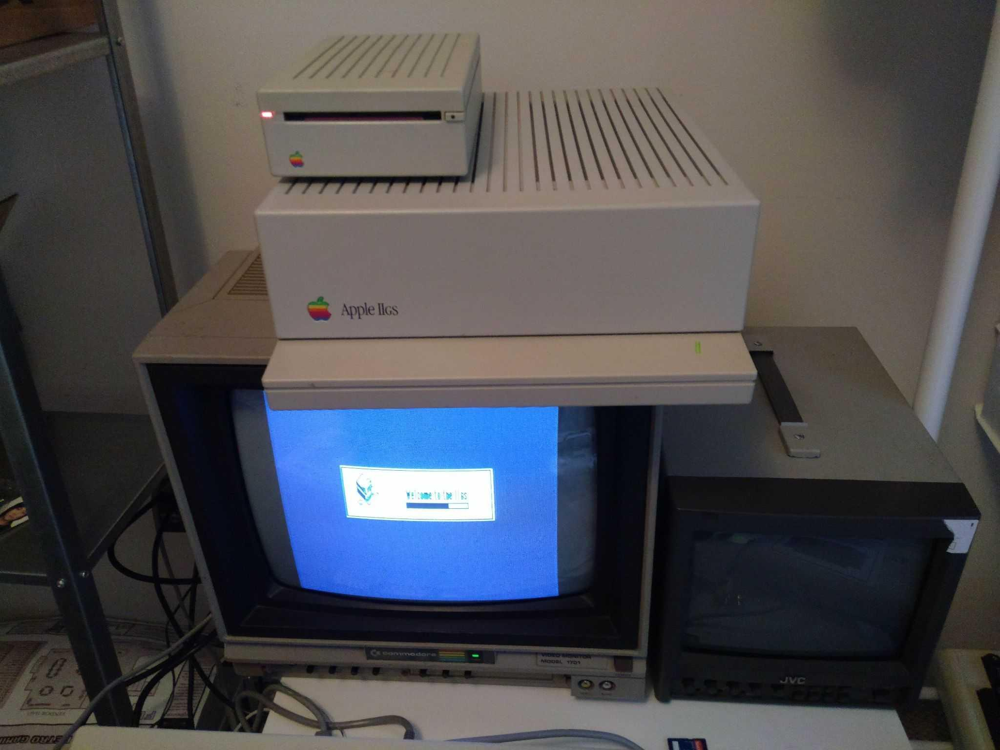
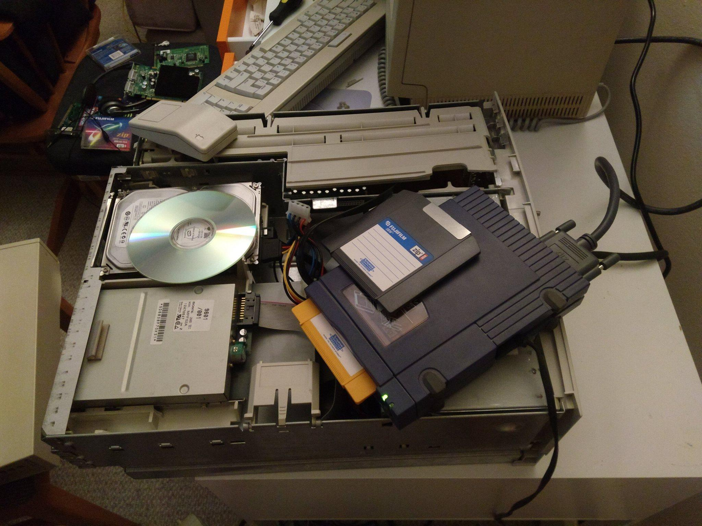
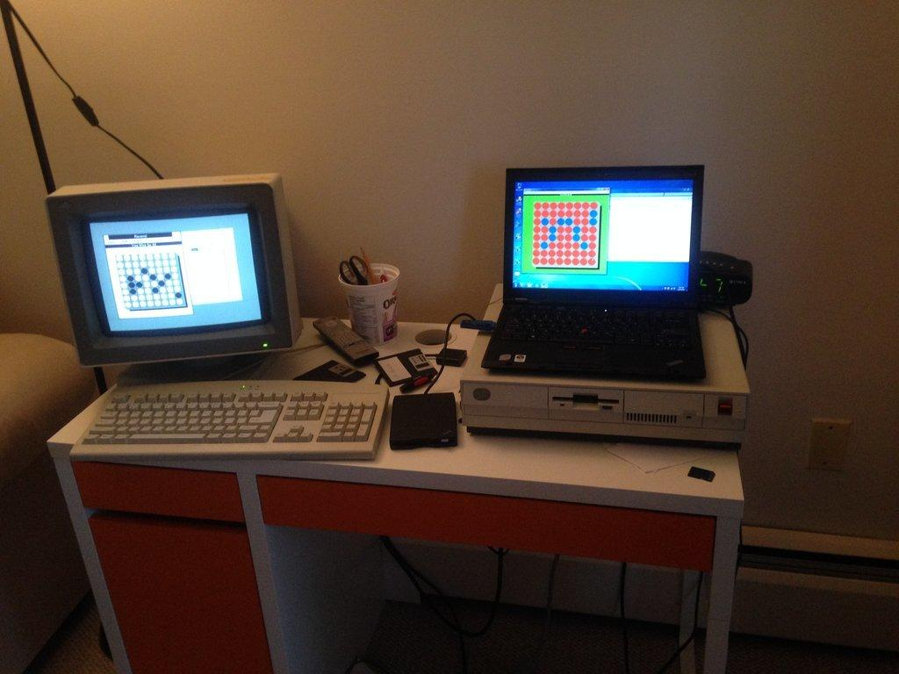
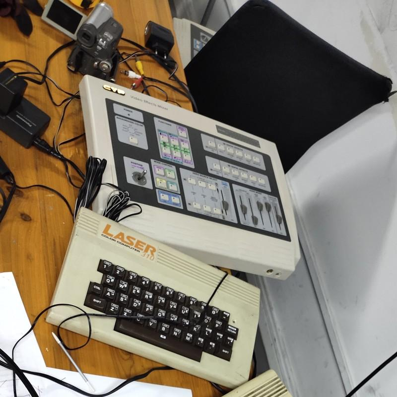

# Storage Media
Today's topic is storage media. When dealing with new media exhibitions, we often need to handle potentially outdated storage media. While modern PCs can handle almost all media types, practical operations frequently encounter various obstacles. Computer access to storage media is shifting from default inclusion to optional add-ons. If you were to buy a new computer today, it would likely lack an optical drive, and even machines like the MacBook Pro from 2016 onwards lack standard USB ports. Computer manufacturers are almost coercing users into heavy reliance on the internet and uploading all their data online for transfer.

However, whether an art collector or a curator, there's often a need to present past works to today's audience. This frequently involves dealing with older storage media, like the pile I've set up in the classroom, which includes videotapes, cassette tapes, CDs, floppy disks, and more. The primary aim of this lesson is to showcase the characteristics of different storage media and how to handle them.

## Models of Electronic Storage
The operation of electronic storage media typically falls into three models. The first is the disk model, the most common scenario encountered on computers. When handling files on a computer, we're working with a disk model of storage media. These disks generally have a specific type of file system and allow for random read and write operations.

Another model is the optical disc model. When creating a CD, for example, there's often a need to create a master image before burning it onto the disc. Once burned, CDs typically can't be easily modified, known as the WORM (Write Once Read Many) model. Even rewritable discs often require erasing the entire disc to modify its contents, rather than random file rewriting. However, there is an exception with rewritable discs using the UDF file system, allowing disk-like access.

The third model is the tape model, seen in videotapes and cassette tapes. Tapes usually lack a file system and require sequential read and write operations. However, like disks, tapes offer the ability for multiple writes, and the starting point for writing on tapes is typically flexible.

## Floppy Disk
The disk model is one of the most common models we encounter, and the floppy disk represents the simplest implementation of this model. The 3.5-inch floppy disk I brought today was once prevalent. It has a small window on its shell, which opens when inserted into the floppy drive, allowing the read/write head to access the magnetic surface. Its structure for storage is straightforward—a plastic sheet coated with magnetic material, where data is read or written by detecting or altering the magnetic field on the disk's surface.

The image above basically explains how a floppy disk operates. At one corner of the 3.5-inch floppy, there's a small hole with a sliding plastic tab—a write-protect switch. When this hole is open, the contents of the disk cannot be altered. Many characteristics of floppy disks aren't far from our current systems; several resemble hard disks, such as the file system, directory structure, but with significantly smaller capacities.

When discussing floppy disks, we often refer to the 3.5-inch floppy as a "1.44 MB floppy," but in reality, floppy disk formats can be quite complex. When dealing with old computer floppy disks, the initial hurdle often encountered is the disk format. [OmniFlop](http://www.shlock.co.uk/Utils/OmniFlop/) is software specifically designed to read and write data to old computer floppy disks. It provides alternative drivers beyond the default Windows floppy disk drivers, supporting a broader range of floppy disk formats. OmniFlop's website lists approximately 167 floppy disk formats it can read, some with capacities as small as a few dozen KB to over 1600KB.

Even similar-looking 3.5-inch floppy disks might have varying capacities on different computers. Many might not even be readable with standard PC floppy drives. The floppy disk formats of Apple Macintosh and Apple IIGS are notably different from those on IBM PCs. Their 400KB and 800KB formats used a Sony-developed Zoned Constant Angular Velocity (Zoned CAV) floppy drive. Therefore, old Macintosh floppy disks cannot be read using modern floppy drives. I've personally encountered this issue before with my old Macintosh SE, which used an 800KB floppy drive incompatible with standard PC drives, hindering the use of floppy disks as a data transfer medium.



To make it possible to read these less common formats using more readily available equipment, especially floppy drives in IBM PCs and compatible machines, various software and tools have been developed for floppy disk digital preservation and forensics. For instance, [fdrawcmd](https://simonowen.com/fdrawcmd/) is a Windows floppy drive controller driver supporting more floppy disk formats, while [KyroFlux](https://kryoflux.com/) offers a dedicated hardware floppy drive controller capable of reading formats, including Apple 400/800KB formats, that many PC floppy drives cannot.

## Hard Disk
Another common storage medium is the hard disk. Floppy disks derive their name from the flexible plastic used for their disks, while hard disks utilize materials typically made of metal, although some models use glass—materials that cannot bend—hence the term "hard" disk. In fact, hard disks predate floppy disks. Floppy disks were developed in the late '60s and became a commercial product in the '70s, whereas the widely acknowledged first hard disk, the IBM 350 RAMAC, was introduced in 1956.

A floppy disk is a two-dimensional storage structure (not considering double-sided cases), where all data is stored on a single plane. If a hard disk contains only a single disk platter, it logically resembles a higher-density floppy disk. Whether floppy or hard disks, data on the disk is arranged in multiple concentric rings referred to as "tracks," and each track is divided into segments known as "sectors".

The structure of hard disks is more intricate than floppy disks. Roughly speaking, a hard disk can be seen as a stack of floppy disks. Most hard disks have multiple disk platters, creating a three-dimensional structure. Tracks positioned identically across multiple disk platters form a logical grouping, constituting a logical "cylinder." Each disk platter has its independent read/write head(s). If both sides of a disk platter have magnetic material, there are two read/write heads per disk platter, and as a result, each head operates within a non-overlapping range.

To locate data on a hard disk, three pieces of information are required: the cylinder number where the data resides, the head (indicating which disk platter and which side), and the sector where the data is stored. This information, often referred to as "CHS" data, allows precise data positioning on the hard disk. Even modern disk tools continue to use this method to access data. For example, although the physical structure of solid-state drives (SSDs) no longer contains a disk structure, their firmware still emulates CHS information, and the disk partition table relies on CHS parameters to establish partitions.

CHS addressing remains the most commonly used method for handling large-capacity storage on PCs. Even though the CHS information reported by modern hard disks no longer corresponds directly to the physical structure of the disk—such as reporting tens or hundreds of heads, which is incongruent with modern hard disk structures—tools like DiskGenius display partitions on the disk based on a set of starting and ending cylinder-head-sector (CHS) information.

However, the CHS information provided by modern computer hard disks no longer accurately represents the hardware's physical structure. For instance, reported head numbers in disk tools might range from dozens to hundreds, which clearly does not align with the actual structure of modern hard disks. Also, in solid-state storage devices like memory cards, while there's CHS information, it no longer relates to any rotating mechanical structure. This CHS information is simulated for software compatibility and is known as Logical Block Address (LBA) technology.

## Removable Disks and Memory Cards
Many storage devices that do not structurally resemble hard drives simulate CHS information to provide software compatibility. For instance, the Zip drive is a typical example. Physically, it's an upgrade from the floppy disk, slightly larger with a more robust outer shell, and similar internal disk material. Despite its physical structure resembling a floppy disk, software operations on the Zip disk follow CHS addressing rules similar to hard drives.



The Jaz drive is another intriguing case representing the primary approach to make hard drives portable before the common USB-based mobile hard drives today. The disks were relatively inexpensive, but the mechanisms for reading and writing, like the heads and control circuits, were costly. In the Jaz drive, the disk was placed inside a removable and portable cartridge, while the heads and control circuits remained fixed inside the drive. Upon its launch in 1995, its capacity was comparable to internal hard drives of that time. However, due to the fixed heads and circuits, upgrading the capacity required replacing the entire drive rather than just swapping the disk cartridge. Consequently, it was replaced by the USB mobile hard drives that became common after the 2000s.

Another storage device using CHS addressing is the optical magnetic disk, also known as the MO disk or MO optical disk. It's readily available in second-hand markets, as many archival institutions used it for long-term storage until tape drives gradually replaced it in recent years. The MO disk operates by magnetic writing and optical reading, employing the Faraday effect where light deflects upon encountering a magnetic field, allowing data reading through changes in light. Despite being an optical storage device in principle, unlike CDs or DVDs, it operates more like a disk in software and has a CHS structure.

The latest devices utilizing a hard drive-like storage method are memory cards and solid-state drives (SSDs), both based on flash memory chips. However, they also report CHS structure to software. Documentation for industrial storage cards, including [CF cards](https://docs.rs-online.com/5e7c/0900766b80d86218.pdf) and [SD cards](https://www.apro-tw.com/Databank/2009%20Datasheet/Industrial%20SD/100-WPSDMD-01V1.pdf), provides CHS parameters as a reference for embedded developers.

Although memory cards roughly adhere to hard drive standards in software operations, their interface and form factor complexity present numerous challenges to users. There are complexities in compatibility between memory cards, as well as standard and non-standard adapter cards. For example, MMC cards typically work in SD card slots, almost all CF cards can convert to PC cards without performance loss, and many memory cards have PC card versions of card readers. However, the compatibility and stability of these adapters vary, often requiring actual testing to confirm their performance.

## Hard Drive Interfaces
Talking about memory cards highlighted the issue of different interface compatibilities, and interface concerns remain one of the significant challenges in digital preservation. The commonly seen SATA interfaces in modern computers are relatively easier to handle since both the 2.5-inch drives for laptops and portable hard drives, as well as the 3.5-inch drives for desktops, use a consistent SATA interface. However, the older PATA (IDE) interface had two standards: a 44-pin connector for 2.5-inch drives and a 40-pin connector for 3.5-inch drives, requiring the use of adapter cards.

Additionally, as mentioned earlier, CF and SD cards can be adapted to IDE interfaces, and corresponding adapter cards are common. The CF to IDE adapter is particularly suitable for showcasing old PCs, such as works on 486 or 586 computers. Last fall, during the exhibition of "People's Computer" in Shanghai, I used an SD to IDE adapter. Newer storage cards are more reliable, cheaper than older small-capacity hard drives, and easier to maintain. They can be easily removed and used for operations on modern PCs. This convenience is highly practical for curators exhibiting old computer-related artifacts and artists creating art using old computers.

However, the SCSI interface, which I'll discuss next, is like the "deep end" of computer storage interfaces. Until the early 2000s, SCSI interfaces were slightly faster than IDE interfaces of the same period, with lower CPU usage, and were widely used in high-end PCs and servers. Most Apple computers before the mid-90s also had SCSI interfaces.

One of the challenges with SCSI interfaces is the configuration of the daisy chain. The daisy chain refers to linking multiple devices one after another, with only one interface connecting to the host. To ensure the chain's proper functioning, a terminator must be set on the last device farthest from the host. Some devices have built-in terminators, controlled by switches on the device, while others require external hardware terminators connected to the device's free SCSI interface.

Though dealing with SCSI interfaces can be troublesome, it's often the most convenient way to operate old Apple computers. For instance, as I mentioned earlier, my old Macintosh SE, which I couldn't fix with a floppy disk, was eventually used with a SCSI-connected Zip drive. Just like I mentioned earlier, the Zip drive worked as a hard drive in the software's view, and the old Macintosh firmware recognized the Zip drive as an external hard drive, allowing direct booting from it, making my operations much more convenient. As the Zip drive also has a USB version, I could easily swap disks and use a modern PC to write prepared OS and application images onto the Zip disk and run them on the old Macintosh using an emulator.

However, if your device has an IDE interface, it's better to avoid using SCSI. SCSI interfaces have various types, such as the external SCSI interface of old Apple computers being a 25-pin DB-25, while the internal SCSI interface is a low-density 50-pin interface. Many peripherals use high-density 50 or 68-pin connectors. From the 80s to the 2000s, SCSI interfaces covered a wide range of computer hardware with different functionalities and eras. Even though theoretically, nested multiple adapters could connect all devices, they might not all work properly. That's why when I used the PowerMac 7300, I installed a PCI SATA card to connect the hard drive, bypassing the SCSI interface.

## File Systems
Another challenge in digital preservation is encountering various file systems in old computers' disks. The FAT16 or FAT32 used in IBM PCs and compatibles is the easiest to handle. Generally, if the disk has an appropriate interface to connect to the host, disks with FAT formats are mostly readable on modern computers. Additionally, Windows systems largely maintain binary compatibility with old applications. Even 32-bit Windows 7 and Windows 10 can directly run many 16-bit Windows 3.0 programs.



As an example from my own experience, I have a 1987 IBM PS/2 Model 30 with a 720KB 3.5-inch floppy drive. With a USB floppy drive, I successfully copied a Windows 3.0 game of Othello and executed it on a Windows 7 computer. Linux, developed initially for the IBM PC, supports ext2, introduced in 1993, and reading it on current distributions poses no major obstacles.

However, there are more challenges with Apple systems. One issue is the incompatibility with earlier mentioned floppy disk formats. The 400k and 800k Macintosh floppy drives were discontinued after the PowerMac G3, and regular PC floppy drives cannot read them. This requires multiple data migrations, necessitating a compatible machine like my Power Macintosh 6100 and Power Macintosh 7300, both acting as intermediaries for the Macintosh SE, exchanging data with modern computers via Ethernet due to their Ethernet cards. This is a common approach when dealing with data from old computers.

Another challenge when handling files from old Apple computers is the HFS file system's type and creator codes. Unlike Windows or later macOS versions that use file extensions to denote file types, old Mac OS systems store file types in HFS file attributes. Transferring files using non-HFS formatted disks may result in losing file types stored in HFS attributes, leading to uncertainty about which program to use to open the file. Thus, handling these file systems requires special attention. If you still have a Mac OS 9 or earlier Apple computer, tools like [FileTyper](https://www.macintoshrepository.org/2050-filetyper) or [FileType](http://www.frederikseiffert.de/filetype/) can be used to view and modify HFS file system type and creator codes.


When dealing with disks of uncertain formats, Windows tools like DiskGenius or R-Studio can be used to investigate disk partition conditions. Often, disk tools on Apple systems hide many file system details, making diagnosis and repair challenging. Moreover, newer Linux kernels have built-in hfsplus modules, enabling low-level operations on Apple HFS partition tables using Linux tools like [GParted](https://gparted.org/), which the macOS built-in disk utilities does not support.

## Optical Discs
Let's delve into optical discs. One characteristic of optical discs is their storage structure, which comprises one or several continuous tracks, unlike hard drives that have a regular multi-layered concentric structure. Hence, they cannot be addressed using the CHS structure. Typically, a pure data CD-ROM has only one track, while multi-track CDs are often used to store different types of data on a single disc, such as storing both audio and data. IsoBuster, a disc backup tool, has [articles on CD and DVD disc structures](https://www.isobuster.com/help/cd_dvd_layout).

One way to understand the structure of optical discs is through a CUE script, which records detailed information about the disc tracks. The Hydrogenaudio Knowledgebase has [detailed documentation on CUE scripts](https://wiki.hydrogenaud.io/index.php?title=Cue_sheet). Let's take a look at the CUE sheet for a standard CD-ROM, which has only one track in MODE1/2048 format.

```
CATALOG 0000000000000
FILE "Myst (1994)(Broderbund).iso" BINARY
  TRACK 01 MODE1/2048
    INDEX 01 00:00:00
```

On the other hand, a VCD's CUE sheet typically uses MODE2/2352 format.

```
FILE "Image.bin" BINARY
  TRACK 01 MODE2/2352
    INDEX 01 00:00:00
  TRACK 02 MODE2/2352
    INDEX 00 00:29:02
    INDEX 01 00:31:00
```

All CD discs are structured into sectors of 2352 bytes each. However, the MODE1 design of CD-ROMs is intended for data storage, allocating some space for error correction and verification, limiting each sector's data storage to 2048 bytes.

Being the first affordable, widely distributable high-capacity digital storage, CDs were initially designed for music storage. This led to the emergence of various standards tailored to store different types of content. For instance, the initial CD standard in 1980 was termed the "Red Book." The CD-ROM, introduced in 1985 for computer data discs, was not standardized initially. It wasn't until 1988 that the corresponding "Yellow Book" was established. On the other hand, CD-i, designed for multimedia interactive content, diverged from CD-ROM standards with its "Green Book" in 1986, with corresponding devices released in 1990. The writable CD standard, known as the "Orange Book," emerged in 1988. The VCD, a popular home video medium in China, adopted the "White Book" standard in 1993.

The CD-i format is relatively uncommon domestically but has garnered increased attention and research overseas in recent years. The [Black Moon Project](http://www.blackmoonproject.co.uk/) hosts extensive details about CD-i, while the [CDinteractive forum](http://www.cdinteractive.co.uk/forums/cdinteractive/) serves as another resource for CD-i information.

Following the 1990s, the CD-based 12cm discs evolved into higher-density successors, namely DVD and Blu-ray discs. Many characteristics of CDs, especially CD-ROMs, were inherited, such as the 2048-byte sector size and the ISO9660-based disc file format. This explains why ISO remains the most popular format for disc image files today.

Similar to the diverse file systems found on hard drives, [different file systems exist on optical discs](https://www.isobuster.com/help/file_systems). The original ISO9660 supported only 8.3 filenames. However, since Windows 95, operating systems have supported long filenames. Consequently, most modern optical discs use ISO9660 as a base and incorporate Joliet extensions to support long filenames. Apple Macintosh, especially the Classic Mac OS predating Mac OS X, widely utilized the HFS file system on optical discs.

UDF gradually replaced ISO9660 as the standard for optical disc storage after the mid-2000s. A prime example is that Windows installation discs post-Windows 7 cannot be read on operating systems that do not support UDF formats. Additionally, Blu-ray discs default to using UDF as their file system.

Another significant application of UDF lies in its better support for random read-write capabilities. When an optical disc, like a CD-RW, is formatted with the UDF file system, it allows files to be added, modified, or erased freely, much like a hard drive. In Windows Vista or newer versions of Windows, inserting a rewritable optical disc prompts the choice between operating in "Live file system" (Microsoft's term for the UDF file system) or "Mastered" mode. Opting for the former formats the disc into UDF, enabling similar read-write capabilities as a USB drive. Choosing the latter creates an ISO9660 image of the disc on the hard drive until the disc is ejected, and then it writes everything at once.

The development of UDF is closely tied to the development of DVDs. It was included in the 1996 DVD-Video standard and is used on nearly all movie DVDs. Compared to earlier VCDs, DVD discs possess greater programming capabilities, supporting a programmable "virtual machine". Consequently, they were used to develop some video-based electronic games. For instance, the interactive DVD game of Harry Potter that I showcased in class is one such example.

[Inside DVD-Video](https://en.wikibooks.org/wiki/Inside_DVD-Video/Interaction_Machine) provides detailed insights into the functionalities of the DVD interactive virtual machine. One notable aspect of DVD interactive games is their programmability, integrated within the DVD-Video disc standard. Hence, any DVD player or gaming console adhering to these standards can run such games, making it a viable approach for cross-platform gaming on gaming consoles.

In the updated Blu-ray Disc standard, a Java virtual machine known as BD-J is directly employed. This advancement enables the development of more complex games. [Blu-play website](http://www.blu-play.com/) offers numerous BD-J game downloads and development resources.

## Videotapes

Let's dive into a medium that's not as closely related to computers: videotapes. The formats of videotapes are quite diverse, not just in terms of external dimensions but often hiding various generations and distinctions between analog and digital within tapes that share similar outer appearances.

In terms of handling, we can broadly categorize videotapes into two types: analog and digital. Analog tapes include the most common ones like VHS, SVHS, VHS-C, Video8 (V8), Hi8, Betacam, BetaMax, while digital tapes encompass the likes of MiniDV, Digital 8, DVCPRO, DVCAM, MicroMV, D-VHS, among others. Compatibility between them is quite chaotic; generally, newer machines of the same size can handle older tapes. For instance, SVHS players can handle VHS tapes, Digital 8 players can play Hi8 and Video8 tapes. There are also cases of different-sized tapes being interoperable; for example, smaller VHS-C tapes can be adapted into VHS players using an adapter, and many DVCPRO and DVCAM recorders can work with MiniDV tapes. Overall, it's about the new accommodating the old, and the large accommodating the small. So, if you're handed a videotape you're unfamiliar with, you'll likely need to investigate which machine can play it.

Most videotape recorders rely on helical scan recording, usually employing a rapidly rotating head that creates inclined magnetic tracks on the tape in the direction of movement. This method differs from linear recording on cassette tapes, which can be edited by cutting and splicing. Video editing with videotapes typically requires segment-by-segment dubbing. This editing technique involves linearly storing video segments at different playback times on the tape, hence termed linear editing. In contrast, non-linear editing allows for random access to video segments stored on computer disks.

The simplest linear editing system can be assembled using two videotape recorders: material in recorder A and the produced result in recorder B. To concatenate two segments, recorder A must be fast-forwarded to the position of the first segment. Then, while recorder A plays, recorder B records. When the first segment ends, pause the recording on recorder B, fast-forward recorder A to the second segment's position, then start recording on recorder B while playing the second segment on recorder A. This process joins video segments from different positions into a continuous video. Repeating this loop yields a complete video composed of spliced segments.

MediaCollege.com provides [detailed guide](https://www.mediacollege.com/video/editing/linear/setup.html) on assembling a tape-based linear editing system. Since linear editing heavily relies on playback time, maintaining precise editing positions can be challenging on non-professional equipment. Therefore, professional-grade recorders often support timecode functionality to ensure alignment during editing.

## Video Mixer

Another device commonly used in linear editing is the video mixer, allowing for the creation of classic video effects prevalent in the analog TV era. It can execute effects like blue/green screen keying, picture-in-picture, and transitions without relying on a computer, directly implementing these effects in the video signal path. When coupled with VCR for editing, it's interconnected between the VCR playing the material and the VCR recording the result. While playing, the editor can real-time manipulate effects using the mixer and record them onto the producing VCR.

With a video mixer, many classic video effects can be achieved. For instance, the fly-in/fly-out effect involves combining green screen with picture-in-picture functionality. This technique places the actor's image into the background using the green screen and then uses picture-in-picture to zoom in, zoom out, or move the image left and right—all controlled easily through the levers on the effects mixer.

Pairing an old computer with a effects mixer creates a setup resembling an 80s-style character generator. Since old computers had limited capabilities, they couldn't overlay subtitles directly onto the video. Instead, they typically placed a solid color background behind the text. Then, using the effects mixer's Chroma Key or Luma Key functions, they would overlay the text onto the video through picture-in-picture, achieving the effect of video subtitles.



Even in modern content creation, this type of video mixer retains practical value. One application is producing nostalgic videos, accurately recreating the vintage TV effects seen in shows like "Journey to the West" and "Ultraman." Additionally, analog effects mixers offer almost no delay when producing the desired effects. Although limited in resolution due to analog signals, they prove highly valuable in situations where minimizing delay is more critical than achieving high image quality, such as in live performances.

## Video Capture

We just demonstrated several common scenarios for editing videos during the era of videotapes. Now, let's delve into the process of video capture. During the demonstration, I was constantly navigating through various cables, which can be another headache in video processing.

The most prevalent analog video cable is the Composite Video cable, typically featuring three colors: yellow, white, and red. However, the white and red are audio left and right channels, respectively, with only the yellow carrying the video signal. While this cable is present in almost all analog video devices, the image quality it delivers is relatively inferior. Another frequently used cable is the Y/C component cable, also known as S-Video. Its interface looks similar to PS/2 port for keyboard and mouse on a computer. The S-Video connector comprises four pins, representing two pairs of lines. Its luminance and chrominance are separate, resulting in a better-quality image compared to the Composite Video cable. The third type is the component video cable, commonly found in DVD or Blu-ray players as it supports high-definition output.

Sometimes, you might encounter the SCART, a European standard plug, which can be a bit perplexing because it may transmit various signals—sometimes component, other times S-Video, RGB or YPbPr composite video. Finding equipment that supports SCART signals is ideal, but such devices are usually available primarily in Europe. Connecting SCART devices with those that don't support SCART requires consulting the SCART device's manual to determine the specific supported signals and using corresponding adapters accordingly.

Most analog TV tunner cards or video capture cards typically come with at least composite video and S-Video interfaces. Component interfaces are often found only in high-definition capture cards. Many gaming streamers use component cables to capture game console screens. TV cards might also handle RF coaxial television signals, FM radio signals, and digital TV signals.

For DV tapes, since they are digital in nature, the best way to capture their quality is by using a IEEE 1394 cable. The IEEE 1394 interface, often referred to as i.Link in many camcorders, particularly Sony models, typically comes with a small 4-pin connector. The 6-pin IEEE 1394 interface is the most common on computers and was found on Apple computers from around 2000 to 2010. Additionally, the 9-pin IEEE 1394b interface was also quite prevalent on Apple computers from 2003 to 2012. However, after 2012, the Retina Display Macbook Pro models no longer featured a 1394 interface and could only be connected via IEEE 1394 to Thunderbolt adapter.

The difference between these three interfaces is that the 9-pin IEEE 1394b supports a transfer speed of 800 Mbps, while the 4-pin or 6-pin 1394a only supports 400 Mbps. Thus, when using a 1394b to 1394a data cable, all IEEE 1394b devices will operate at the reduced speed of 400 Mbps. However, interchanging the two IEEE 1394a interfaces does not affect the speed. The 6-pin interface, compared to the 4-pin, includes a 12V power supply function, but most DV devices do not utilize the 1394 port for power, except for the early iPods.

There are rare instances where certain set-top boxes use the SCSI interface. For instance, the NOKIA DVB9600S supports connecting a hard drive via SCSI to record digital TV programs. DVB2000, an alternative operating system developed by enthusiasts for the NOKIA DVB9600S, contains detailed technical information about SCSI interfaces, SCART interfaces, and digital TV in [its documents](https://trippstadt.wohnheim.uni-kl.de/sat/Operating%20Manual%20Dvb2000%20englisch.pdf).

However, in most cases, the recording of digital TV is typically done using either a IEEE 1394 cable or Ethernet. Many set-top boxes support transmitting MPEG-TS (MPEG Transport Stream) over Ethernet, allowing users to losslessly transfer digital TV streams from set-top box to their computers with softwares like VLC. With these variant methods for converting analog and digital videos into digital files, enabling different forms of video to be stored as digital files on computers for editing and production purposes.

## Cassette Tapes

The last topic we'll discuss is cassette tapes. They were the first devices to gain popularity in households, often utilized in small-scale personal recording setups. As the starting point for home recording, cassette tapes had a profound impact on popular culture and even caused panic among record labels. The British Phonographic Industry (BPI) once used the slogan "Home Taping Is Killing Music" to advocate against cassette tapes and home recording, suggesting it would lead to rampant piracy within the music industry. However, some bands and labels embraced home recording by leaving the B-side of sold tapes blank for buyers to record on their own.

In China, a notable invention related to cassette tapes was the "Repeater"(复读机/fù dú jī), utilizing RAM similar to computer memory to store recently played audio segments. Pressing the "repeat" button would pause the tape playback and play the audio segment stored in memory. Transcribers have similar function to the "Repeater", although its "repeat" (Backspace) function relied on mechanically rewinding tape for a specific length.

Because cassette tapes were affordable and easy to duplicate, they became popular in many developing countries much earlier than other recording distribution channels like vinyl records. In China, their widespread use in the 1980s became the foundation for Chinese pop music. Dual-cassette recorders have since become a cultural symbol of the '80s and '90s music scene, particularly associated with disco, often appearing in displays and spaces nostalgic for that era.

Cassette tapes also had a less common yet crucial use: storing computer data. For instance, computers like the Laser 310, which we showcased, had a tape recorder interface used to save and load programs. Today, computers, phones, or digital recorders can used as replacement to tape recorders for loading programs into vintage computers.

That's all for today; we've covered the characteristics and uses of disks, optical media, and tapes. These storage mediums either directly formed components of multimedia computers, like disks and optical discs, or their operational logic was inherited by multimedia computers, as seen in the "audio recorder" programs found on computers and phones, often mimicking the control panels of cassette tape recorders. In the next class, we'll delve into another origin of modern media machines: vintage personal computers.
