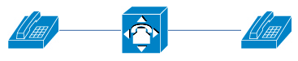
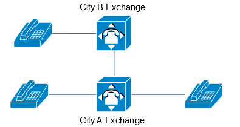
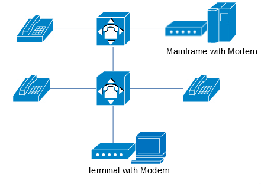
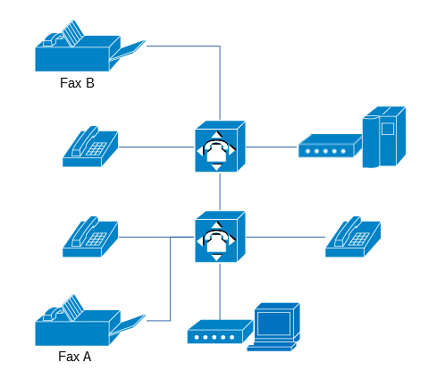
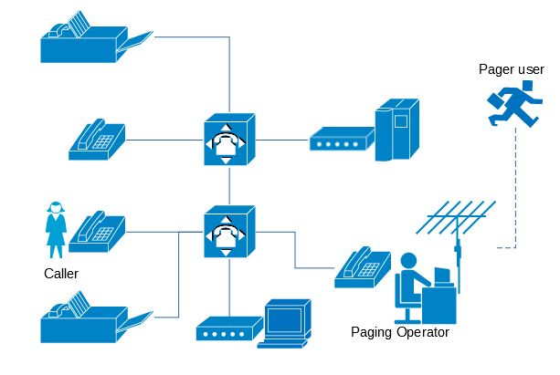
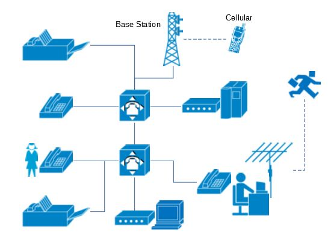
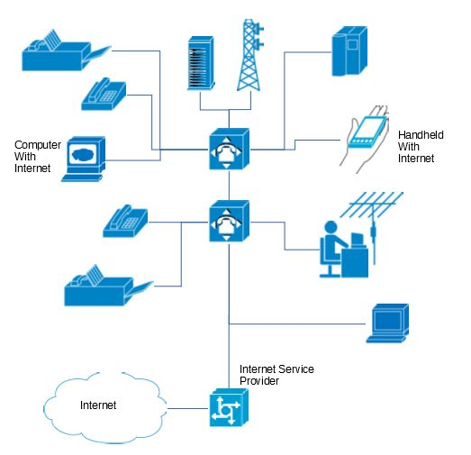
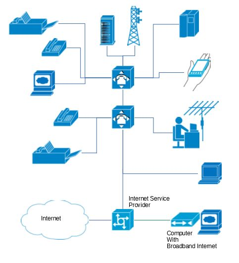

# Telecommunications Networks
Welcome to the third session of digital media archaeology. In this class, we'll delve into issues surrounding telecommunications networks. Nowadays, we often refer to the internet as a "virtual" world, a term that leads many to overlook the physical infrastructure of networks when designing, critiquing products, services, and engineering related to the internet. Specifically, in the eyes of numerous internet product managers or critics, services such as WiFi or 5G networks seem to emerge from the ground or the air. Even though we may know which telecommunications company provides our network services, we tend to have little understanding of the resolute and complex physical infrastructure behind wired interfaces and wireless signals.

Today, I've set up an array of equipment, most of which are connected to telephone lines. I aim, from the perspective of media archaeology, to retrace how the internet, in its primitive stages before the era of fiber optics, emerged from the telephone network. During this class, I've constructed a hypothetical telecommunications company. Through this fictitious company's "entrepreneurial history", I'll showcase how telecommunications technology evolved from local telephone communication networks, covering only a few hundred meters or kilometers, into a global network, and how telephone companies transitioned into internet service providers.

Additionally, I'll demonstrate how the telephone network influenced the personal computer revolution. Apple's co-founders, Wozniak and Jobs, were enthusiasts of the "blue box." The blue box was a device used for hacking into the telephone network, signifying that hackers were active in the telephone network before they emerged on the computer network.

Brazilian artist Eduardo Kac, known for creating telecommunications art using Minitel, presented "Aspects of the Aesthetics of Telecommunications" at the 1992 Siggraph conference on computer graphics[^1]. Today's class will focus more on experimental demonstrations. However, if you're interested in related theories, I highly recommend reading Kac's paper.

## A Basic Telephone Network
Let's explore how the most fundamental telephone network operates. I've set up a telephone exchange and a corresponding operator's switchboard phone in the classroom. The exchange model is quite old, a 1990s Nitsuko TX824 model. However, the operator's phone has informative lights that clearly indicate the telephone exchange's operational status. When I pick up one phone, for instance, number 12 lights up on the switchboard phone. Then, when I pick up another phone, let's say number 14, it appears on the switchboard as well.

Next, I dial 12 from phone 14, causing the phone marked as 12 to ring. Upon answering, a connection is established, allowing communication between the two phones. This illustrates the fundamental operation of a telephone network: establishing a circuit between two phones via a telephone exchange. The connections between different phones are facilitated by relays within the telephone exchange, creating an actual connected circuit between them.

From pre-World War II until the 1960s, before the widespread emergence of long-distance telephone networks, most telephone systems resembled this small-scale telephone exchange. At telecommunications museums like the Connections Museum in Seattle, visitors have the opportunity to observe operational vintage telephone exchanges, often characterized by the clicking of numerous relays, typically Crossbar Switches. Older telephone exchanges featured rows of wiring posts and connecting arms, known as Panel Switches.

## Artistic Creations via Telephone
Even when the telephone network was solely capable of voice communication, pioneers in the art world began exploring artistic creation through telephony. For instance, László Moholy-Nagy's "Konstruktionen in Emaille" (Constructions in Enamel) in 1922 stands as an early representation of telecommunication art.

If you're familiar with Bauhaus history, you might know László Moholy-Nagy as one of its members, renowned for influential paintings and photography. However, many consider Moholy-Nagy's most famous and valuable piece to be "Konstruktionen in Emaille," also known as the "telephone picture." This moniker comes from its creation process: the artist remotely directed factory workers via telephone to create this enamel piece. Thus, this work validated the concept of "remote presence" in artistic creation for the first time. Since the outbreak of the COVID-19 pandemic, remote presence has become a widely discussed topic, usually facilitated through telecommunications technology. Consequently, this piece is often referenced when discussing "remote presence."

In 1967, the nonprofit organization "Experiments in Art and Technology" (E.A.T.) was founded by engineers Billy Klüver and Fred Waldhauer from Bell Labs, along with artists Robert Rauschenberg and Robert Whitman. This group delved into numerous experiments closely related to telecommunication technology.

Another notable instance was the "Art By Telephone"[^2] exhibition at the Museum of Contemporary Art in Chicago in 1969. Here, all artworks were created without blueprints or plans; participating artists solely relied on verbal descriptions via telephone to instruct on-site personnel in constructing their pieces.

## Long-Distance Telephone Networks and Monopolies in Telecommunications

During the 1960s, a period when telephones frequently appeared in artistic creations, there was widespread construction of long-distance telephone networks in the United States. Let's simulate how a long-distance telephone network operates: using two telephone exchanges representing local telephone networks in two cities, we connect them via telephone lines, creating a long-distance line between the two cities, with the corresponding line number being the long-distance area code.

However, we'll notice that one telephone line can only carry one call. To have multiple users engaged in long-distance calls simultaneously, more cables need to be laid between the two locations, often at considerable expense. Consequently, long-distance phone lines were considered a scarce resource compared to local telephone lines. For instance, if one long-distance call is already connected, attempting a second one will encounter a busy line. It was only with the introduction of the carrier system based on coaxial cables and frequency-division multiplexing, allowing multiple calls on a single cable, that widespread long-distance networks became feasible.

Let's conduct a manual switchboard experiment. Users in the telephone network dial the telephone company's operator, who manually connects the call. The need for manual switching occurred in two scenarios: before the advent of automatic switching systems, almost all calls were manually connected, and in long-distance calls. Before the widespread use of the Signaling System No. 7 in 1984 for interconnection between different communication carriers' equipment, calls between carriers often couldn't be automatically processed by telephone exchanges, requiring manual intervention.

Another noteworthy feature of the telephone network is Dual-tone multi-frequency (DTMF). When pressing different numbers on today's landline phones, we hear distinct sounds, which are processed by remote telephone exchanges or voice response systems. Unlike the pulse signals used in early telephone dialing systems that couldn't traverse multiple layers of switches, DTMF uses ordinary audio signals, enabling transmission through all switches, facilitating the use of multi-level switch long-distance telephone networks.

Contrary to what we commonly observe today, for a considerable time in the early 20th century, local and long-distance telephone services in the US were operated by different carriers. This stemmed from the emergence of independent telecommunications operators after the expiration of Bell's telephone patents in 1894. At that time, regional local networks operated by Bell were interconnected via AT&T's long-distance telephone network, while independent operators faced competitive pressure from AT&T and Bell. The Willis Graham Act of 1921 established telephone companies as natural monopolies, gradually allowing AT&T to dominate the US communications industry throughout the 20th century and culminating in the famous AT&T breakup in 1982.

When considering modern-day Internet services, the monopolistic nature of the Internet and telecommunications services bears significant similarities. AT&T once used tactics like refusing interconnection or setting high long-distance fees to suppress competitors and force users into their telephone network. Similar events occurred in China, where in the early 2000s, inter-network telephone and messaging charges between different mobile operators were noticeably higher than within the same network. This resulted in China Mobile gaining an imbalanced dominant position, leading the government to resort to administrative measures to demand companies lower these inter-network settlement charges.

## Phone Phreaking and Computer Hacking

During the countercultural wave of the 1970s, AT&T was seen by some counterculture communities as a symbol of monopoly or authoritarianism. One of these countercultural groups, represented by the Yippies, adopted an activist approach to challenge this monopoly. They issued a publication called "Youth International Party Line" (YIPL) to disseminate techniques for hacking the long-distance telephone network billing systems. Similar to computer hackers, this practice was termed "Phone Phreaking."

Their publication used a broken Bell symbol as a logo, symbolizing their opposition to AT&T's dominance. "Youth International Party Line" and its subsequent publication, "Technological American Party" (TAP), featured many detailed technical articles. For instance, the "Ultimate Red Box" mentioned in their content was a device used to hack public telephone coin systems. The article provided detailed circuit diagrams and manufacturing guides.

This practice also encouraged the emergence of computer hackers. In the 1970s, computers were still relatively expensive resources, affordable mainly to large corporations and institutions. However, establishments equipped with computers occasionally allowed remote dial-in access, providing computer rental services to other users or for communal educational purposes.

The movie "WarGames" showcased a popular activity among early hackers called "War Dialing." During that time, many computers were connected to the telephone network through modems. Modems could convert digital signals from computers into analog audio signals for transmission over phone lines and vice versa, enabling the exchange of data between remote computers or providing remote access to computers.

In the 1970s and 80s, there was no modern internet accessible to the public. The typical form of computer service involved users dialing large mainframes via modems attached to microcomputers equipped with terminals. This setup presented opportunities for hackers who utilized "War Dialing" to invade computer systems. They would systematically dial through phone numbers listed in telephone directories, ultimately discovering and infiltrating weakly protected mainframes connected to the telephone network.

During the 1970s, computer literacy was still limited, and the skills and security awareness of computer maintenance personnel were often inadequate. Many computers connected to the telephone network had default system passwords unchanged or used easily guessed weak passwords. Consequently, many hackers managed to infiltrate computer systems merely by employing default passwords provided in operation manuals. The infamous "414" hacking case in 1983 involved a group of high school students who, through this primitive method, infiltrated over 60 computers. The name "414" originated from the telephone area code of Milwaukee, Wisconsin, where they resided.

Next, I'll demonstrate roughly how they used to connect to remote computers back then. The machine I'm using is a terminal, and you might have noticed that this terminal employs a liquid crystal display. It's a relatively newer product from the early 2000s. Even until the 2000s, industries like banking and postal services extensively used similar terminals. They connected via dial-up to handle counter transactions and related operations with small-scale and mainframe computers. During this period, remote computer access technology had become considerably secure. Surprisingly, personal computers were relatively more vulnerable in terms of security.

My terminal connects to the phone line using a Hayes Modem, supporting AT command sets to dial numbers via commands. When we type "AT", the Modem responds with "OK", indicating readiness to dial. Using the "ATDT" command followed by a phone number, I initiate a call to the specified phone. Of course, we also need a computer to act as the remote host. Here, I'm using a Linux-based computer to simulate it. Linux, an operating system mimicking Unix, originates from the Bell Labs' development of Unix in the 1970s for the PDP-11. Hence, many functionalities and operational habits are reminiscent of that era.

If the remote computer's Modem accepts our call, a handshake sound similar to dial-up internet Modems can be heard. If all goes well, the terminal will display a login prompt from the remote computer. The terminal itself doesn't run programs. After logging into the remote system, all operations run on the remote computer. The terminal merely transmits our inputs and displays outputs from the host through the communication line. In the 1970s, many people's initial computing experiences came from such remote dial-in systems. Even if they might not have had the chance to physically access the mainframe in the server room, having a terminal at home, school, or office allowed access to resources on remote computers.

Because computer resources were limited and shared among many users, some schools and institutions imposed strict hierarchical user privileges on their computer systems. This sparked discontent among some computer enthusiasts advocating for equality. They used technical means to bypass various restrictions on computer systems. Richard Stallman, the initiator of the GPL license, was among them. The notion of equality, indiscriminate sharing, and the emergence of the free software community had their roots in this period.

We observed a significant transformation in the telephone network during this era. Originally designed for voice transmission, it had evolved to transmit data. By encoding data, telephone lines became capable of transmitting images or various other types of encoded information.

## Fax machines

Fax machines became widely popular around the same time as the widespread use of computer modems. While the prototype for the fax machine dates back to 1843, invented by the Scottish inventor Alexander Bain, even predating the telephone, the extensive use of faxing began with Ricoh's launch of the first commercial digital fax machine, the RIFAX 600s, in 1973.

By the 1980s, some artists began exploring the fax machine's ability to transmit images over telephone networks, using fax as a medium for artistic creation. This movement gave rise to fax art as a novel art form. The event that truly brought fax art into the public eye was the creation of "Global-Art-Fusion" in 1985 by Boyce, Warhol, and Kaii Higashiyama, who relayed artwork using fax machines between Düsseldorf, New York, and Tokyo, ultimately faxing the pieces to a museum collection in Vienna. Through telecommunications networks, the artwork virtually circled the globe, showcasing the global communication capabilities of the telephone networks connected via telephony and undersea cables in the 1980s.

Today, we have a fax machine on-site, and we can try using it for relay art. After the receiving fax machine presses the "start" button, we'll hear a sequence of beep sounds, which is the fax machine's CNG (calling tone). Then, when we press the "start" button on the sending side, the fax machine begins transmitting. We'll hear a high-frequency sound similar to the one heard when a Modem handshakes, known as CED (called station identification), as the fax machine also transmits images through a Modem.

Since many fax machines use thermal paper for printing, they can only output black-and-white images. The color parts often exhibit a grid-like effect due to dithering, producing some unique visual effects. Additionally, relay-based creation is an intriguing characteristic of fax art. In China, participation in fax art is scarce. The only known exhibition and creative activity related to fax art was the inaugural Shanghai International Fax Art Exhibition in 1996, themed "Let's Talk About Money".

## Pagers
In the realm of telecommunications, pagers are closely related to telephones but operate quite differently. They utilize communication technologies like frequency-shift keying (FSK), similar to those in modems, to transmit text messages via radio waves. However, this mode of information transmission is unidirectional—messages can only be sent from a paging station to a pager and typically cannot be replied to directly from the pager. Bi-directional pagers that allowed direct message replies only emerged in the mid-to-late 1990s, but their usage was not as extensive as that of uni-directional pagers.

Recreating the operation of a pager nowadays is not difficult. On online marketplaces, it's not hard to find radio enthusiasts selling pager transmitters developed using software-defined radio (SDR) technology. By running the included transmission software on PC, these devices can work with pagers. The typical pager service workflow depends on telephony: there's an automated paging station where callers need to dial the paging station and input the receiver's pager number. The paging station then forwards the caller's phone number to the pager. There's also a type of paging station capable of sending text messages, requiring manual operation. Some paging stations are also known as "secretary service", where the sender verbally dictates the message, and the operator type in and sends it via a computer.

In our "telco in classroom", I'll role-play as a pager operator to demonstrate the paging process:

- Operator: "Hello, this is the Paging operator."
- Sender: "Please page 12345."
- Operator: "Please leave your message."
- Sender: "Ask about today's homework for me..."
- (Operator types and sends the page via computer)
- Pager: Beep-beep-beep-beep...

Pagers are not internet-connected devices, but they have had a profound impact on instant messaging applications on the internet. The most successful product in Chinese internet history, QQ, has deep roots in paging services. QQ's predecessor, OICQ, was initially developed as a value-added service for China Motion Telecom's paging station. Tencent, in its early days, collaborated with multiple paging stations, providing services to relay internet instant messages to pagers.

Another connection between telephony and paging is that the telephone serves as the most common backward channel for one-way paging networks. If the sender is familiar with receiver, they leave their name; otherwise, if it's a stranger or an unfamiliar number (like a payphone), they leave a callback number in the pager message, allowing the receiver to establish contact.

Even today, pagers are still used in some industries. In 2016, the artist Brannon Dorsey created a device called Holypager[^4], utilizing software-defined radio technology to intercept and print all nearby pager service information. This artwork was showcased at the 2017 Radical Networks conference in Brooklyn, New York, to raise awareness about the vulnerability of protocols like POCSAG used in pagers without encryption, highlighting potential privacy risks in wireless communication and the digital space.

## Mobile Phones
Next, I'd like to explore mobile phones, showcasing the Personal Handy-phone System (PHS), which was just retired in Japan last year. PHS was a typical 2G mobile phone technology, closely associated with landlines compared to other mobile communication technologies. PHS base stations often directly connected to landline networks through ISDN lines used by digital telephones. Phone numbers also utilized landline numbers, making them essentially "embedded" in the landline network.

Today, retired PHS handsets can still be used as cordless phones, paired with home phone base stations with landline functionality like the "Qbox" cordless system. The PHS device we have on display operates through this cordless feature, connecting with other phone calls.

Within our "classroom teleco" setup, we now have telecom services based on landline networks, including landlines, fax, pagers, computer terminals, and mobile phone services based on PHS technology. Today, many communication devices are affordable enough that we can set up something akin to a "pirate telephone company" just like a "pirate radio" station.

If you're interested in exploring telecommunication art, new artworks might involve new technologies like VoIP telephony. Using a VoIP voice gateway allows interoperability between IP networks and phone networks. Leveraging the prevalent internet connectivity today, it's possible to connect several small-scale analog telephone networks, like the one in our classroom, into a larger network. By simulating long-distance phone networks through VoIP, one can inexpensively exhibit and perform phone and fax artworks across regions, showcasing them as part of an artistic creation.

## Emergence of Network Art
Let's shift our focus back to the remote dial-up computer systems we showcased earlier. The predecessors of network art emerged in the late 1970s and early 1980s around similar systems, known as Telematic Arts. These works were typically displayed using computer terminals and were thus referred to as terminal art.

Whether Roy Ascott's endeavors around computer terminals in the 1980s or the renowned Electronic Café International[^5], terminals connected to telephone networks played a pivotal role. The structural diagram of Electronic Café International depicts a thick line labeled "Phone company," interweaving the entire artwork. Each section of the work revolved around terminals or computer hosts connected via modems to telephone lines. Terminals with handwritten drawing boards and terminals linked to Community Memory can be seen.

Community Memory was the earliest public-accessible BBS (Bulletin Board System). Its name encapsulates the basic operation of a social network—shared "memory" among community members. Each user could log in through a terminal and store or retrieve content they wished to share. This shared storage-based system served as the precursor to various network forums. Technologies like CBBS and FidoNet that followed Community Memory constituted the initial form of social networks. These networks emerged before the popularity of the internet and significantly influenced the structure of many similar services on the internet.

The principles of BBS were similar to remote access to large hosts, except BBS systems had lower hardware specifications, often running on microcomputers. CBBS in 1978 was the first widely used BBS system, and in 1984, Fido BBS offered software enabling different BBS to exchange data via telephone lines, forming a network: FidoNet, distinct from today's internet.

The prosperity of BBS penetrated the art world. In 1991, Wolfgang Staehle's The Thing BBS was a dedicated online community discussing contemporary art and cultural theories. Artists could share information, works, and engage in discussions. In 1995, The Thing BBS transcended into the internet era, becoming the first art community operating online.

In our classroom, you can experience how dial-up BBS used to function. The essence of modem communication is akin to connecting two computers like teleprinters. Whatever I type on one side will appear on the other side, and vice versa. In today's TCP/IP protocol, "ports" simulate this process, offering bidirectional transfer capabilities on each port.

Our classroom's BBS server runs a backup from the renowned "Beijing Paradise BBS" in 1998, which is a node of Chinese FidoNet, or CFido[^6]. Accessing a dial-up BBS doesn't require an internet account, yet it allows posting, chatting, and even second-hand trading. The fundamental organizational form of information in the BBS system is mail, equivalent to the "discussion board" in today's online forums, referred to as "mail zones" for reading posts.

## Internet Service Providers

Some enthusiasts and non-profit organizations also utilized facilities similar to BBS, like modem dial-up systems, to offer internet access without charging any network access fees. This type of internet access was often referred to as Free-Net. For users in the area where Free-Net operated, the only cost for using the internet was the local call charges. Since in many parts of the USA, local calls were on a monthly package, residents in these areas could access the internet very affordably after the advent of Free-Net.

Community wireless networks that emerged in some countries today, such as Spain's Guifi.net, can be considered successors to Free-Net's spirit. Similarly, in our "classroom teleco" also provides internet access. We can experience how ISPs worked during the dial-up era. Our dial-up network offers a 33.6Kbps internet access, this is the highest speed achievable with analog modems; 56Kbps dial-up networks required special digital modem equipment.

The telecommunication services provided by "classroom teleco" at this time are close to the late 1990s' standards. Computers accessing the network via telephone lines have full TCP/IP protocol support, enabling various functionalities of the internet.

The initial mobile internet also emerged during this period. I've brought along an IBM WorkPad C3 (Palm Vx) handheld computer from 1999. Equipped with a modem and Eudora Internet Suite containing a browser and email client, it allows us to revisit the late 1990s' mobile internet experience.

The last device I'll showcase today is the EoC (Ethernet over Coax) cable modem. It's commonly used to provide broadband internet via cable TV networks, Cable Modems often employ two different technologies: CMTS and EoC, but I won't delve into details here, opting for the easier-to-configure EoC for this demonstration. Alongside ADSL, the cable modem marked the final stage before the widespread introduction of fiber optics.

In the 2000s, both telephone and cable TV companies underwent significant fiber optic upgrades to their network infrastructures, with fiber optic cables laid down on streets and in neighborhoods. However, the cost of directly installing fiber optics in older buildings remained relatively high, leading to the use of existing telephone and cable TV lines to provide broadband services. These broadband networks, based on existing lines, achieved transmission speeds of several to tens of megabits, meeting the requirements of most contemporary network applications. With the proliferation of broadband networks, the internet was separated from telephone lines, and many households opted out of landline telephones in favor of internet only services.

And thus, the story of our small "classroom teleco" concludes. From local telephone calls, long-distance calls, dial-up computer terminal, fax, pagers, mobile phones, BBS, dial-up internet to broadband internet, the technological evolution showcased in the classroom mirrors the real-world development of the telecommunications industry. The virtual world of networks we see today isn't illusory but is built upon numerous cables, switches, modems, terminals, servers, routers, and other network devices. The ultimate material of "network art" is precisely these hardware devices. Their functionalities and characteristics shape and limit the patterns of human behavior on networks.

## 参考资料
[^1]: Aspects of the Aesthetics of Telecommunications http://www.ekac.org/telecom.paper.siggrap.html
[^2]: Art By Telephone https://mcachicago.org/Exhibitions/1969/Art-By-Telephone
[^3]: 亚洲艺术文献库中存档的“我们谈谈钱–上海首届国际传真艺术展”资料 https://aaa.org.hk/tc/collections/event-database/lets-talk-about-money-shanghai-first-international-fax-art-exhibition
[^4]: Holypager https://brannondorsey.com/project/holy-pager
[^5]: Electronic Cafe http://www.ecafe.com/
[^6]: 中国惠多网 https://www.cfido.com/
[^7]: guifi.net https://guifi.net/
